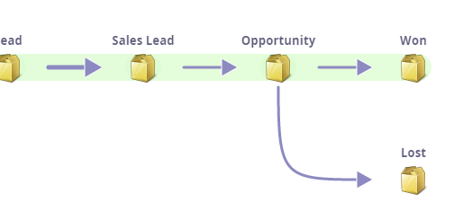

# 수익 모델 이해 {#understanding-revenue-models}

수익 주기 모델은 마케팅을 한 단계 업그레이드합니다. 이 모델은 리드와 처음 상호 작용할 때부터 리드가 성공한 고객이 될 때까지 전체 매출 단계의 모든 단계를 모델링합니다.

## 정신 모델(이에 대한 생각 방법) {#mental-model-how-to-think-about-this-thing}

Modeler은 물이 담긴 일련의 양동이와 같다. 양동이의 바닥에 구멍이 뚫려 있다.

이 모델러는 하루에 양동이에 얼마나 많은 물(리드)이 들어가는지, 그리고 구멍에서 얼마나 많은 물이 나오는지 측정합니다. (구멍이 두 개 이상 있을 수 있음)

모델러는 모두 주어진 시간에 버킷의 리드 양을 측정합니다. 이것을 무대 균형이라고 합니다.

>[!TIP]
>
>금융 마인드가 더 높은 분들이라면 하루하루가 끝날 때 잔액으로 돈이 오가는 통장으로 단계를 떠올릴 수 있다.

모델은 일반적으로 스마트 캠페인 및 프로그램에 익숙하고 분석을 다음 수준으로 이동하려는 고객을 위한 것입니다.

## 새 모델로 시작 {#starting-with-a-new-model}

기본적으로 새 모델은 6개의 수익 단계로 시작됩니다. 이 모델은 사실 그 자체로도 괜찮지만 심층 맞춤화가 가능하다.

모두 녹색 배경에 있습니다. 이를 **성공 경로**&#x200B;라고 합니다. 성공 경로 [여기](/help/marketo/product-docs/reporting/revenue-cycle-analytics/revenue-cycle-models/understanding-revenue-model-success-path.md)에 대해 자세히 알아보세요.

**단계**&#x200B;은(는) 목표를 향한 잠재 고객 진행에 대한 이정표입니다.

**전환**&#x200B;은 화살표로 표시되며 단계 간 잠재 고객 이동 방식을 제어합니다.

>[!NOTE]
>
>익명의 무대는 특별하다. 여러분의 웹 사이트를 방문하는 모든 사람들이지만, 그들이 누구인지는 확실하지 않습니다. 이 단계는 수정할 수 없습니다.

## 사용자 지정 {#customization}

회사마다 다릅니다. 오른쪽 상단에서 를 드래그하여 모델에 항목을 추가할 수 있습니다.

## 인벤토리 단계 {#inventory-stage}

이것은 상자처럼 생겼고 가장 기본적인 단계입니다. Analytics는 이 단계의 유입, 유출 및 균형을 추적합니다.

## SLA Stage {#sla-stage}

**Service level agreement** 단계에 대해 짧습니다. 여기서의 목적은 시간 제한을 적용하려는 일부 단계입니다.

>[!NOTE]
>
>**예**
>
>잠재 고객이 &quot;Contact Me&quot; 양식을 작성하고 Sales Rep 에게 경고를 보내면 72 시간 SLA 가 필요할 수 있습니다. 당신은 위반 사항을 계속 추적할 수 있을 것이며, 의사소통에 좋은 리드를 남긴다는 것에 대해 대표를 꾸짖을 수 있을 것이다.

## 게이트 스테이지 {#gate-stage}

게이트 스테이지는 리드를 여러 선택 사항 중 하나로 필터링하려는 상황을 위한 것입니다. 이 옵션은 고급 옵션입니다. 초보자는 출입문을 피해야 합니다.

>[!NOTE]
>
>**예**
>
>**명명된 계정 목록**&#x200B;에 속하는 잠재 고객에 대해서는 게이트를 사용하여 일반 프로세스와 분리할 수 있습니다.

## 전환 {#transitions}

스마트 캠페인을 사용하여 잠재 고객이 한 단계에서 다른 단계로 이동하는 방법을 정확하게 파악하고 잠재 고객이 어떤 단계에서도 멈추지 않도록 하십시오. (평가하는 방법)으로 전환하려면 트리거 필터를 사용하십시오.

>[!NOTE]
>
>**예**
>
>양식을 채우는 리드에 의해 전환을 정의할 수 있습니다.

행복한 성공 경로에서 단계 추가

Lost는 추가하기에 좋은 것이지만 녹색 경로에 있지 않습니다. 그것은 그것이 &quot;성공&quot;이 아니기 때문입니다.

>[!MORELIKETHIS]
>
>* [새 수익 모델 만들기](/help/marketo/product-docs/reporting/revenue-cycle-analytics/revenue-cycle-models/create-a-new-revenue-model.md)
>
>* [수익 모델 인벤토리 단계 사용](/help/marketo/product-docs/reporting/revenue-cycle-analytics/revenue-cycle-models/using-revenue-model-inventory-stages.md)
>
>* [수익 모델 게이트 단계 사용](/help/marketo/product-docs/reporting/revenue-cycle-analytics/revenue-cycle-models/using-revenue-model-gate-stages.md)
>
>* [수익 모델 SLA 단계 사용](/help/marketo/product-docs/reporting/revenue-cycle-analytics/revenue-cycle-models/using-revenue-model-sla-stages.md)
>
>* [수익 모델 보고](/help/marketo/product-docs/reporting/revenue-cycle-analytics/revenue-cycle-models/report-on-your-revenue-model.md)
>
>* [수익 모델 승인/승인 취소](/help/marketo/product-docs/reporting/revenue-cycle-analytics/revenue-cycle-models/approve-unapprove-a-revenue-model.md)
