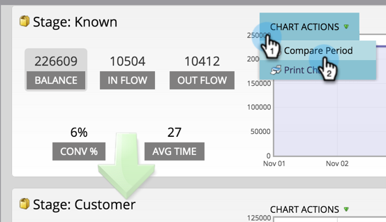

# 성공 경로 분석기 사용 {#using-the-success-path-analyzer}

성공 경로 분석기를 사용하여 [매출 주기 모델 단계를 통해 사람들의 흐름(양)과 속도(일 기준 속도)를 모두 반영하는 구체적인 세부 사항을 탐색합니다](understanding-revenue-models.md).

>[!NOTE]
>
>**사전 요구 사항**
>
>[성공 경로 분석기 만들기](create-a-success-path-analyzer.md)

1. Analytics **로** 이동하여 **성공 경로 분석기를 선택합니다**.

   

   오른쪽의 차트는 왼쪽의 선택된 단추에 있는 데이터를 반영합니다. 기본적으로 이것은 균형입니다.

1. 흐름 **을** 클릭하여 선택한 기간 동안 스테이지에 들어온 사람 수를 그래프로 그래프로 표시합니다.

   

   * 단계를 종료한 사람의 수를 그래프로 그리려면 [흐름 종료]을 클릭합니다.
   * 전환 비율을 클릭하여 전환율을 이 단계에서 다음 단계로 그래프로 표시합니다.
   * 다음 단계로 이동하기 전에 이 단계에서 사람들이 보낸 시간을 보려면 평균 시간을 클릭합니다.

1. 데이터를 동일한 길이의 다른 **시간대에 비교하려면 차트 작업** > 기간 비교를 클릭합니다.

   

1. 비교 기간 **에** 대한 시작 날짜를 선택합니다.

   

   종료 **** 날짜는 원래 기간의 길이와 일치하도록 자동으로 설정됩니다.

1. 비교를 **클릭합니다**.

   

1. 비교 기간 동안 차트가 겹치는 데이터로 녹색으로 업데이트됩니다.

   

1. 차트의 시간 비율을 변경하려면 **그래프별** 단추 중 하나를 클릭합니다.일별(기본값), 주별 및 월별

   

1. SLA(서비스 수준 계약)가 있는 단계의 경우 **차트 작업** >** SLA 표시**를 클릭하여 지정된 기간 내에 SLA 목표를 지키지 않은 모든 사용자를 표시합니다.

   

1. 각 노드에서 발생한 SLA 를 주황색으로 반영하여 차트가 업데이트됩니다.

   

   주황색으로 표시된 사람들이 SLA 단계에 있을 수도 *있고 그렇지 않을* 수도 있습니다.

1. 지정된 기간 말에 SLA 단계에 있는 만료된 SLA 타겟을 가진 모든 사용자를 표시하려면 **차트 작업** >** SLA 기한 지난 시간 표시**를 클릭합니다.

   

1. 주황색으로 각 노드에서 SLA가 지연된 횟수를 반영하도록 차트가 업데이트됩니다.

   

1. 특정 노드(날짜)에 있는 데이터 포인트의 특정 세부 사항을 읽으려면 버블 위에 마우스를 놓습니다.

   

1. 차트를 인쇄하려면** ****차트 작업** > 차트 **인쇄를 클릭합니다**.

   

분석기가 모델을 통해 움직임을 이해하는 데 도움이 됩니다. 이러한 고급 기능은 마케팅 활동을 전략화하는 데 중요한 역할을 하게 됩니다.
