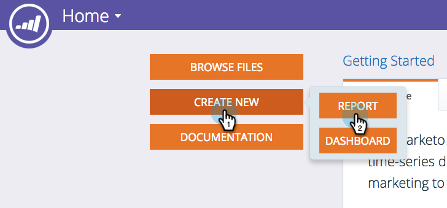

# 매출 탐색기 보고서 만들기 {#create-a-revenue-explorer-report}

매출 탐색기 보고서를 사용하면 마케팅 이니셔티브에 대한 ROI를 추적할 수 있습니다.

>[!AVAILABILITY]
>
>모든 고객이 이 기능을 구입한 것은 아닙니다. 자세한 내용은 영업 담당자에게 문의하십시오.

1. 로 이동합니다. **매출 탐색기** 영역.

   

1. 클릭 **새로 만들기** 그런 다음 **보고서**.

   

1. 보고서 유형을 선택합니다.

   

   좋아요! 보고서를 공식적으로 만들었습니다. 일부 필드를 추가하여 사용자 지정할 시간입니다!

   

>[!MORELIKETHIS]
>
>[매출 탐색기 보고서에 필드 추가](/help/marketo/product-docs/reporting/revenue-cycle-analytics/revenue-explorer/adding-fields-to-a-revenue-explorer-report.md)
>[매출 탐색기 보고서에 사용자 지정 측정 추가](/help/marketo/product-docs/reporting/revenue-cycle-analytics/revenue-explorer/adding-custom-measures-to-a-revenue-explorer-report.md)
