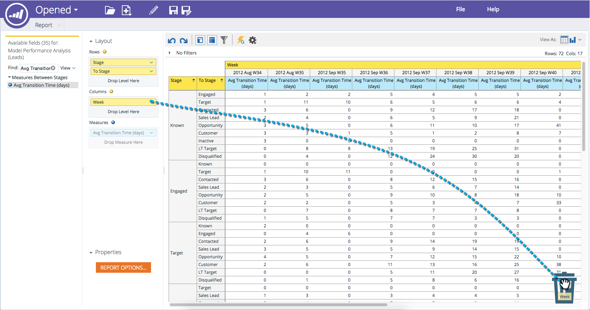

# 매출 탐색기 보고서에서 필드 삭제 {#deleting-a-field-in-a-revenue-explorer-report}

보고서에 잘못된 필드를 드래그하는 경우가 있습니다. 제거하는 방법은 다음과 같습니다.

1. 제거할 필드를 보고서 오른쪽 하단에 있는 **휴지통** 아이콘으로 드래그합니다.

   

   >[!NOTE]
   >
   >휴지통은 필드를 드래그하기 시작할 때까지 숨겨집니다.

>[!MORELIKETHIS]
>
>* [매출 탐색기 보고서 저장](saving-a-revenue-explorer-report.md)

>

