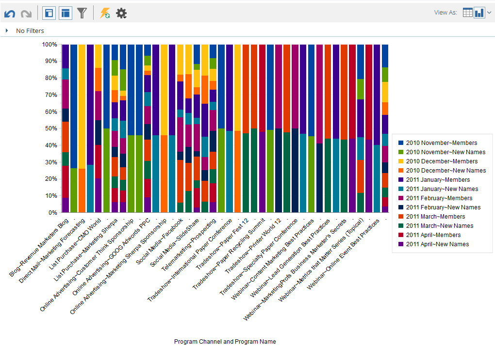

# [!UICONTROL Revenue Explorer]의 그래프 생성 결과 {#graphing-results-from-revenue-explorer}

기본적으로 [!UICONTROL Revenue Explorer]의 보고서는 표로 표시됩니다. 또한 결과를 다양한 형식으로 그래프로 표시할 수 있습니다.

1. 보고서의 **[!UICONTROL View As]** 드롭다운 메뉴에서 화살표를 클릭합니다. 다른 그래프 옵션이 나타납니다.

   

## 그래프 예 {#graph-examples}

**[!UICONTROL Column]**: 테이블의 각 행과 열이 세로 열로 표시됩니다.

**[!UICONTROL Stacked Column]**: 테이블의 각 행에는 그래프에 하나의 열이 있습니다.

**[!UICONTROL 100% Stacked Column]**: 테이블의 각 행에는 그래프에 하나의 열이 있으며 100%로 크기가 조정됩니다.

**[!UICONTROL Line]**: 각 열은 줄로 표시되고 각 행은 그 줄의 데이터 포인트로 표시됩니다.

**[!UICONTROL Column-Line Combo]**: [!UICONTROL Column] 및 [!UICONTROL Line] 그래프의 조합입니다.

**[!UICONTROL Bar]**: 테이블의 각 행과 열이 가로 막대로 표시됩니다.

**[!UICONTROL Stacked Bar]**: 테이블의 각 행에 그래프에 하나의 행이 있습니다.

**[!UICONTROL 100% Stacked Bar]**: 테이블의 각 행은 그래프에 하나의 행을 가지며 100%로 조정됩니다.

**[!UICONTROL Area]**: 데이터가 스택 막대와 비슷하게 표시되지만 채워집니다.

**[!UICONTROL Pie]**: 각 열은 원형 차트로 표시되고 각 행은 구획으로 표시됩니다.

**[!UICONTROL Sunburst]**: 슬라이스의 특성을 나타내는 방사형 그래프입니다.

**[!UICONTROL Scatter]**: 사용된 특성에 따른 거품입니다. 측정값을 사용하여 버블에 색상 코드를 매기거나 버블 크기를 결정합니다.

**[!UICONTROL Heat Grid]**: 양수 및 음수 성능 패턴을 식별하도록 색상 및 모양을 사용자 지정합니다.

1. 표 보기로 다시 전환하려면 표 단추를 클릭합니다.

   
