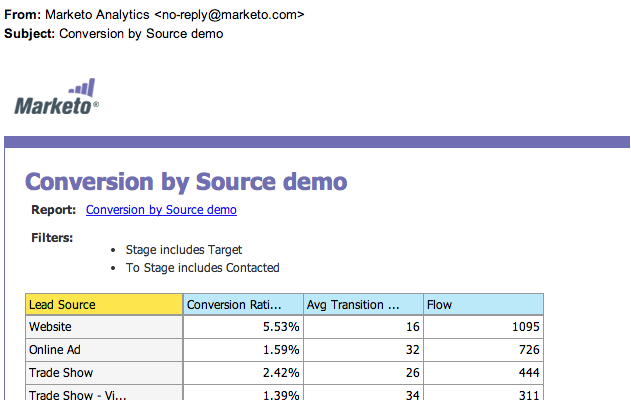

# 매출 탐색기 보고서 구독 {#subscribe-to-a-revenue-explorer-report}

[매출 주기 탐색기](http://docs.marketo.com/display/docs/revenue+cycle+analytics) 보고서로부터 업데이트를 받고 공유하기 위해 기존 보고서에 이메일 주소를 구독할 수 있습니다.

1. **Analytics**&#x200B;로 이동하고 **새로 만들기 > 새 보고서 구독**&#x200B;을 선택합니다.

   

   >[!NOTE]
   >
   >프로그램에서 만든 기본 보고서에 가입하려면 [기본 보고서 가입을 참조하십시오.](../../../../product-docs/reporting/basic-reporting/report-subscriptions/subscribe-to-a-basic-report.md)

1. **보고서 소스**&#x200B;에 대해 [매출 탐색기**]를 선택합니다.

   

1. 폴더 트리를 탐색하고 보고서를 선택합니다.

   

1. 이메일 주소를 입력하고 보고서 이메일의 빈도를 설정합니다.

   

   >[!NOTE]
   >
   >누구나 받은 이메일에 있는 보고서에서 가입을 해지할 수 있습니다.

1. 구독이 설정되었습니다! 자신의 이메일 주소를 포함했다면 이메일로 보고서를 받게 됩니다.

   

>[!MORELIKETHIS]
>
>한 곳에서 [모든 보고서 구독](../../../../product-docs/reporting/basic-reporting/report-subscriptions/manage-report-subscriptions.md)을 관리하는 방법을 알아봅니다.

>[!NOTE]
>
>**자세히 알아보기**
>
>[매출 주기 탐색기](http://docs.marketo.com/display/docs/revenue+cycle+analytics)의 세부 조사에서 Marketing의 고급 분석을 사용하여 할 수 있는 더 많은 작업을 확인할 수 있습니다.

