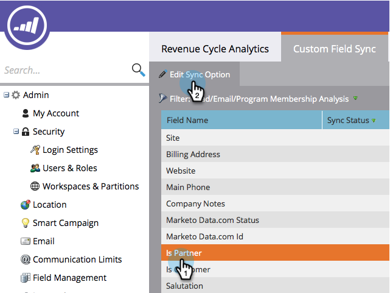

# 사용자 정의 필드를 매출 탐색기에 동기화 {#sync-custom-fields-to-the-revenue-explorer}

매출 주기 분석은 사용자 지정 마케팅 필드에 대해 보고할 수 있으므로 동기화할 사용자 지정 필드를 설정해야 합니다.

>[!NOTE]
>
>**관리자 권한 필요**

1. 관리 **섹션으로** 이동합니다.

   

1. 매출 **주기 분석을 선택합니다**.

   

1. 사용자 **지정 필드 동기화** 탭을 클릭하고 원하는 분석 영역을 선택합니다.

   

1. 동기화할 필드를 선택하고 동기화 옵션 **편집을 클릭합니다**.

   

1. 동기화 상태 **를** 활성화로 **변경합니다**.

   

1. 원하는 **RCA 유형을** 선택한 다음 **저장을 클릭합니다**.

   

   >[!TIP]
   >
   >활성화되면 다음 날 매출 주기 분석에서 데이터를 사용할 수 있습니다.

   잘했어! 이제 RCA에 사용자 정의 필드를 추가하는 방법을 알 수 있습니다.

