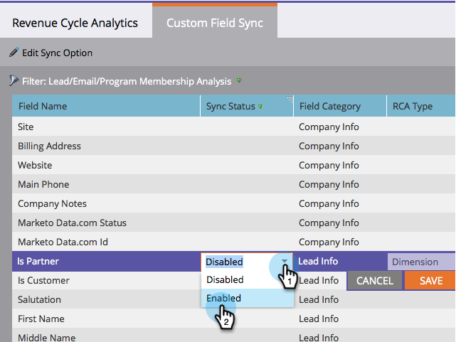

# 사용자 지정 필드를 [!UICONTROL Revenue Explorer]에 동기화 {#sync-custom-fields-to-the-revenue-explorer}

[!UICONTROL Revenue Cycle Analytics]은(는) 사용자 지정 Marketo 필드에 대해 보고할 수 있으며, 이렇게 하려면 사용자 지정 필드를 동기화하도록 설정해야 합니다.

>[!NOTE]
>
>**관리자 권한 필요**

1. **[!UICONTROL Admin]** 섹션으로 이동합니다.

   

1. **[!UICONTROL Revenue Cycle Analytics]**&#x200B;를 선택합니다.

   

1. **[!UICONTROL Custom Field Sync]** 탭을 클릭하고 원하는 분석 영역을 선택합니다.

   

1. 동기화를 활성화할 필드를 선택하고 **[!UICONTROL Edit Sync Option]**&#x200B;을(를) 클릭합니다.

   

1. **[!UICONTROL Sync Status]**&#x200B;을(를) **[!UICONTROL Enabled]**(으)로 변경합니다.

   

1. 선택한 **[!UICONTROL RCA Type]**&#x200B;을(를) 선택한 다음 **[!UICONTROL Save]**&#x200B;을(를) 클릭합니다.

   

   >[!TIP]
   >
   >활성화하면 다음 날 [!UICONTROL Revenue Cycle Analytics]에서 데이터를 사용할 수 있습니다.

   잘했어! 이제 RCA에 사용자 정의 필드를 추가하는 방법을 알 수 있습니다.
