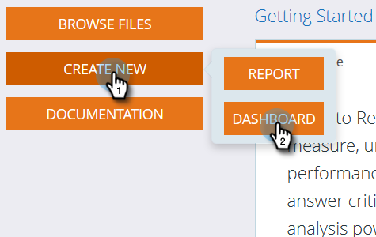
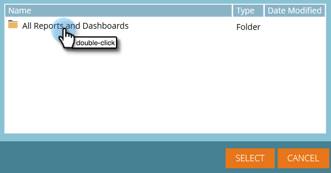

# 매출 탐색기에서 대시보드 사용 {#using-dashboards-in-revenue-explorer}

대시보드는 리드, 캠페인, 기회 및/또는 모델에 대한 빠른 개요를 알 수 있는 매출 탐색기 보고서의 조합입니다.

## 새 대시보드 만들기 {#creating-a-new-dashboard}

1. 매출 **탐색기를 클릭합니다**.

   

1. 새로 **만들기**, 대시보드 **를 차례로 클릭합니다**.

   

1. 페이지 하단에서 기본적으로 템플릿이 선택됩니다. 사용할 레이아웃을 클릭합니다. &quot;2열&quot;은 여기에서 사용됩니다.

   

   >[!NOTE]
   >
   >테마를 클릭하고 즐겨찾기를 선택하여 대시보드 모양 **을** 사용자 정의할 수 있습니다.

1. 대시보드의 첫 번째 섹션에서 **삽입** 아이콘을 클릭하고 **파일을 선택합니다**.

   

1. 매출 **탐색기를 두 번 클릭합니다**.

   

1. 모든 보고서 및 대시보드 **를 두 번 클릭합니다**.

   

1. 사용할 보고서가 들어 있는 폴더를 두 번 클릭합니다.

   

1. 보고서를 선택하고 선택을 **클릭합니다**.

   

1. 그러면 보고서가 채워집니다. 나머지 각 섹션에 대해 4-8단계를 반복합니다.

   

1. 섹션의 이름을 변경하려면 섹션을 클릭하여 선택하고 제목 아래에 원하는 이름을 입력한 다음** 적용**을 클릭합니다. 각 섹션에 대해 반복합니다.

   

1. 저장하려면 저장 아이콘을 클릭하고 파일 이름을 입력한 다음, 대시보드에 대해 원하는 폴더를 찾을 때까지 매출 탐색기 폴더를 두 번 클릭한 다음 **저장을 클릭합니다**.

   

## 대시보드 편집 {#editing-a-dashboard}

1. 매출 **탐색기를 클릭합니다**.

   

1. 매출 탐색기 **폴더를** 두 번 클릭합니다. 대시보드가 상주하는 위치로 이동합니다.

   

1. 편집할 대시보드를 선택한 다음 **편집을 클릭합니다**.

   

## 대시보드 삭제 {#deleting-a-dashboard}

1. 매출 **탐색기를 클릭합니다**.

   

1. 매출 탐색기 **폴더를** 두 번 클릭합니다. 대시보드가 상주하는 위치로 이동합니다.

   

1. 삭제할 대시보드를 선택한 다음 휴지통으로 **이동을 클릭합니다**.

   

