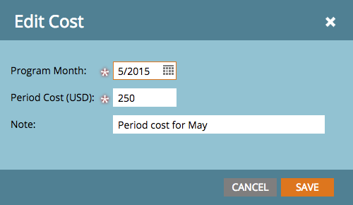

# 기간 원가 정의 {#define-period-costs}

>[!NOTE]
>
>**정의**
>
>기간 비용은 프로그램에 지출하는 금액입니다. 1개월 이상 사용할 수 있으며 ROI 보고에 사용됩니다.

가망 고객 비용을 언제 어디서 부담할 것인지 정의하여 프로그램 또는 이벤트에 대한 가망 고객 지원 및 가망 고객 확보 비용을 추적하고 연관시킵니다.

>[!NOTE]
>
>프로그램 시작 시 예측된 비용을 입력합니다. 프로그램의 기간이 완료되면 기간 원가를 편집하고 실제 원가를 입력할 수 있습니다. 이렇게 하면 정확한 보고 결과를 얻을 수 있습니다.

## 기간 원가 정의 {#define-a-period-cost}

1. 액세스 **설정** 프로그램 또는 이벤트 탭.

   

1. 드래그 앤 드롭 **기간 비용** 캔버스 및 **새 비용** 대화 상자가 표시됩니다.

   

1. 다음을 입력합니다. **프로그램 월** 정의된 원가와 연결하고자 합니다.

   

1. 입력 **기간 비용** 소수 또는 쉼표 없이 정수로 변환(최대 제한: 99999999)

   

   >[!NOTE]
   >
   >통화(예: USD, EUR 등) 는 Marketo 관리자가 관리하는 전역 설정입니다.

1. 설명을 입력하십시오. **참고** (선택 사항) 을 클릭하고 **저장**.

   

## 기간 비용 편집 {#edit-a-period-cost}

1. 기간 원가를 마우스 오른쪽 버튼으로 클릭하고 다음을 선택합니다. **편집** 팝업 메뉴에서 **비용 편집** 대화 상자.

   

1. 필요에 따라 기간 원가 편집

   

## 기간 원가 삭제 {#delete-a-period-cost}

1. 삭제할 기간 원가를 마우스 오른쪽 버튼으로 누르고 선택합니다. **삭제** 을 클릭하여 표시할 팝업 메뉴 **비용 삭제** 프롬프트.

   

1. 클릭 **삭제** 기간 원가를 영구적으로 삭제하려면 **취소** 돌아가려고.

   
