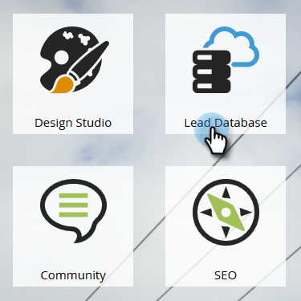
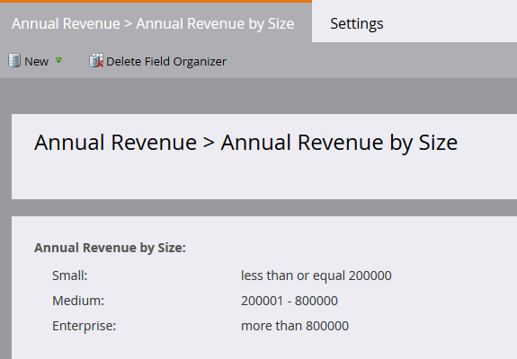
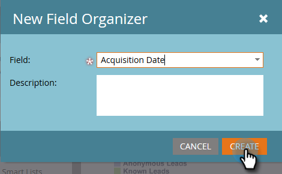
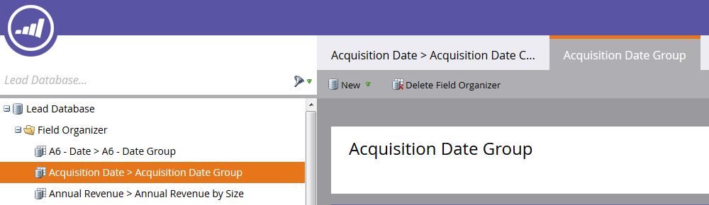
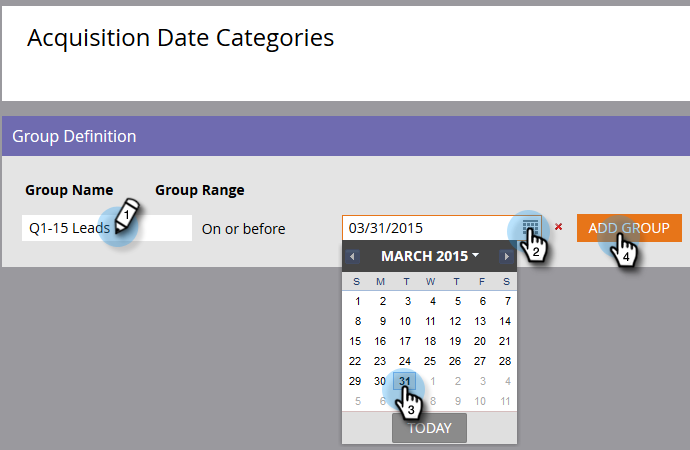

# 필드 구성기를 사용하여 사용자 지정 필드 그룹 만들기 {#create-custom-field-groups-using-the-field-organizer}

매출 주기 탐색기의 모델 성과 분석(리드) 영역에서 보고를 위해 사용자 정의 필드 그룹을 활성화하려면 먼저 마케팅 리드 관리의 필드 구성자를 통해 보고를 위해 표준 또는 사용자 정의 필드를 그룹으로 분류해야 합니다. 이것은 리드 및 회사 특성에만 적용됩니다.
새 필드 구성자 대화 상자의 필드 드롭다운에서 표준 또는 사용자 정의 필드를 선택하면 시스템이 그룹화할 필드와 연관된 마케팅 토 리드 관리 데이터 유형을 필드 구성기에서 사용할 수 있는 세 명의 편집자 중 하나로 매핑합니다.문자열, 정수 또는 날짜

| 마케팅 리드 관리 데이터 유형 | 필드 구성자 편집기 데이터 유형 |
|---|---|
| 문자열 | 문자열 |
| 이메일 | 문자열 |
| 정수 | 정수 |
| 텍스트 | 문자열 |
| URL | 문자열 |
| 참조 | 지원되지 않음 |
| 통화 | 정수 |
| DateTime | 날짜 |
| 부울 | 지원되지 않음 |
| 전화 | 문자열 |
| 날짜 | 날짜 |
| 부동 | 정수 |
| 계산됨 | 지원되지 않음 |

다음 세 섹션은 문자열, 정수 또는 날짜 유형에 대한 사용자 지정 필드 그룹을 만드는 방법을 설명합니다.

## 사용자 지정 필드 그룹 만들기 - 문자열 편집기 {#create-custom-field-group-string-editor}

1. 리드 **데이터베이스를 클릭합니다**.

   

1. 새로 **만들기를**&#x200B;클릭하고 **새 필드 구성기를 선택합니다**.

   

1. 필드 **를** 클릭하고 문자열 편집기에 매핑되는 데이터 유형이 있는 표준 또는 사용자 정의 필드를 선택합니다(이전 섹션의 표 참조). 여기에서 국가가 사용됩니다.

   

1. 만들기를 **클릭합니다**.

   

   새 사용자 지정 그룹은 필드 이름 > 필드 이름 그룹으로 표시되는 리드 데이터베이스 트리에 표시됩니다(예:국가 > 국가 그룹).

   

1. 연필 아이콘을 클릭하여 이름을 사용자 정의합니다. 예를 들어 &quot;국가 그룹&quot;의 이름을 &quot;대륙&quot;으로 바꿀 수 있습니다. 원하는 새 이름을 입력하고 상자를 클릭하여 자동으로 저장합니다.

   

1. 기본적으로 모든 데이터 값은 &quot;기타&quot; 하위 그룹에 배치됩니다. 데이터 값을 분류하려면 그룹 **추가** 를 클릭하여 하위 그룹을 만들고 이름을 지정합니다.

   >[!NOTE]
   >
   >최대 10개의 하위 그룹을 추가하여 데이터 값을 분류할 수 있습니다. 만들어진 각 하위 그룹에는 ID 번호가 할당됩니다.

   이 예에서는 대부분의 대륙에 대해 그룹이 생성되었습니다.

   

   >[!NOTE]
   >
   >하위 그룹을 삭제하려면 하위 그룹 이름 옆에 있는 빨간색 X를 클릭하면 됩니다. 그룹에 데이터 값이 있으면 데이터 값이 기본 그룹인 기타(Other)로 이동합니다.

1. 캔버스에서 데이터 값을 강조 표시하고 데이터 값을 해당 하위 그룹으로 드래그하여 놓습니다.

   

   >[!NOTE]
   >
   >하위 그룹에서 데이터 값을 제거하려면 데이터 값을 [기타]의 기본 그룹에 재지정합니다.

1. 캔버스 바로 위의 왼쪽 위에 있는 필터 옵션을 사용하여 하나 이상의 하위 그룹에서 데이터 값을 선택하고 봅니다. 선택한 필터를 기반으로 하는 데이터 값이 캔버스에 표시됩니다.

   

   >[!NOTE]
   >
   >그룹이 정의되면 Marketing to Lead Management의 매출 주기 분석 탭을 통해 모델 성과 분석(리드)에서 보고를 위한 사용자 지정 필드 그룹을 활성화할 수 있습니다.

## 사용자 지정 필드 그룹 만들기 - 정수 편집기 {#create-custom-field-group-integer-editor}

1. 리드 **데이터베이스를 클릭합니다**.

   

1. 새로 **만들기를**&#x200B;클릭하고 **새 필드 구성기를 선택합니다**.

   

1. 필드 **를** 클릭하고 문자열 편집기에 매핑되는 데이터 유형이 있는 표준 또는 사용자 정의 필드를 선택합니다(이전 섹션의 표 참조). 연간 매출액은 여기에서 사용됩니다.

   

1. 만들기를 **클릭합니다**.

   

   새 사용자 지정 그룹은 필드 이름 > 필드 이름 그룹으로 표시되는 리드 데이터베이스 트리에 표시됩니다(예:연간 매출 > 연간 매출 그룹)을 참조하십시오.

   

1. 정수 편집기 위에 있는 기본 사용자 지정 그룹 이름을 클릭하여 이름을 사용자 지정합니다. 예를 들어 &quot;연간 매출 그룹&quot;의 이름을 &quot;크기별 연간 매출&quot;으로 바꿀 수 있습니다. 저장을 **클릭합니다**.

   

   정수 편집기를 사용하면 여러 하위 그룹을 만들어 각 하위 그룹을 크기별로 정의할 수 있습니다. 이 예에서는 세 개의 그룹이 중소기업 및 엔터프라이즈 비즈니스에 대해 만들어집니다.

1. 첫 번째 그룹을 추가하려면 [그룹 이름] **필드에 이름을** 입력합니다. 예:작음)을 클릭하고 **그룹 범위** 필드에 최대값을 입력합니다(예:20000). 그룹 **추가를 클릭합니다**.

   

   방금 입력한 그룹 아래에 빈 그룹 항목이 표시됩니다. 아래 예제는 중소기업 및 엔터프라이즈 회사에 대한 항목입니다.

   >[!NOTE]
   >
   >최대 10개의 하위 그룹을 추가하여 데이터 값을 분류할 수 있습니다. 각 그룹 범위 항목은 이전 항목을 기반으로 빌드됩니다. 마지막으로 만든 사용자 지정 하위 그룹에 대해 마지막 그룹 범위 항목을 공백으로 두면 최대 데이터 값이 설정되지 않습니다.

1. 요약 탭을 클릭하여 설정을 저장하고 검토합니다.

   

   >[!NOTE]
   >
   >하위 그룹을 삭제하려면 하위 그룹 이름 옆에 있는 빨간색 X를 클릭합니다.

1. 요약 페이지에서 설정을 검토합니다.

   

   >[!NOTE]
   >
   >그룹이 정의되면 Marketing to Lead Management의 매출 주기 분석 탭을 통해 모델 성과 분석(리드)에서 보고를 위한 사용자 지정 필드 그룹을 활성화할 수 있습니다.

## 사용자 지정 필드 그룹 만들기 - 날짜 편집기 {#create-custom-field-group-date-editor}

1. 리드 **데이터베이스를 클릭합니다**.

   

1. 새로 **만들기를**&#x200B;클릭하고 **새 필드 구성기를 선택합니다**.

   

1. 필드 **를** 클릭하고 문자열 편집기에 매핑되는 데이터 유형이 있는 표준 또는 사용자 정의 필드를 선택합니다(이전 섹션의 표 참조). 획득 날짜는 여기에서 사용됩니다.

   

1. 만들기를 **클릭합니다**.

   

   새 사용자 지정 그룹은 필드 이름 > 필드 이름 그룹으로 표시되는 리드 데이터베이스 트리에 표시됩니다(예:획득 날짜 > 획득 날짜 그룹).

   

1. 날짜 편집기 위에 있는 기본 사용자 지정 그룹 이름을 클릭하여 이름을 사용자 지정합니다. 예를 들어 &quot;획득 날짜 그룹&quot;의 이름을 &quot;획득 날짜 카테고리&quot;로 바꿀 수 있습니다. 저장을 **클릭합니다**.

   

   날짜 편집기를 사용하면 여러 하위 그룹을 만들고 날짜별로 각 하위 그룹을 정의할 수 있습니다. 이 예에서는 세 개의 그룹이 만들어집니다.Q1-15 리드, Q2-15 리드 및 Q3-15 리드

1. 첫 번째 그룹을 추가하려면 [그룹 이름] **필드에 이름을** 입력합니다. 예:Q1-15 리드) 및 리드를 취득한 날짜(예:2015년 3월 31일 - 1분기 마지막 날) 그룹 **추가를 클릭합니다**.

   

   >[!NOTE]
   >
   >최대 10개의 하위 그룹을 추가하여 데이터 값을 분류할 수 있습니다. 각 그룹 범위 항목은 이전 항목을 기반으로 빌드됩니다. 마지막으로 만든 사용자 지정 하위 그룹에 대해 마지막 그룹 범위 항목을 공백으로 두면 종료 날짜 값이 설정되지 않습니다.

   

   그게 다야! 잘했어요

아래 예제는 2015년 1분기 리드 3 분기를 위한 항목입니다.