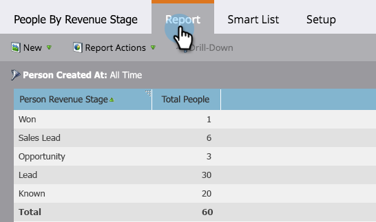

# 매출 단계별 사람 보고서 {#people-by-revenue-stage-report}

사용자가 속한 [매출 주기 모델의 단계를 보여주는 보고서를](http://docs.marketo.com/display/docs/revenue+cycle+models) 만들 수 있습니다. 보고서의 지정된 날짜 범위에 대한 개인 균형이 있는 한, 이 보고서에는 지정된 모델의 모든 단계가 포함됩니다.

>[!NOTE]
>
>**가용성**
>
>일부 Marketing To 에디션에는 이 기능이 포함되어 있지 않습니다. 자세한 내용은 계정 관리자에게 문의하십시오.

1. Analytics로 **이동합니다.**

   ** 

   **

1. 매출 단계별 사람 **보고서를 클릭합니다**.

   ** 

   **

1. 설정 **탭을** 클릭합니다. [만든 사람] **필드를** 두 번 클릭하여 보고할 원하는 기간을 설정합니다.

   

1. 시간대를 편집하고 저장을 **클릭합니다**.

   

1. 보고서 **탭을** 클릭합니다. 이제 사용자가 속한 매출 모델의 단계를 한눈에 파악할 수 있고 모든 병목 현상에 집중할 수 있습니다.

   

   >[!NOTE]
   >
   >**자세히 알아보기**
   >
   >
   >기본 보고에서 열을 추가하는 방법 [등을 알아봅니다](http://docs.marketo.com/display/docs/basic+reporting).

