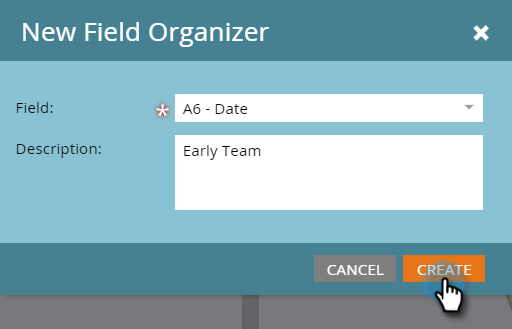

# 필드 조직기 사용 {#using-field-organizers}

필드 이끌이는 가능한 모든 값 중에서 특정 필드를 지정하는 데 도움이 됩니다. 예를 들어, Territory 필드에 대해 West Coast와 East Coast와 같은 의미 있는 그룹화를 만들 수 있습니다. 보고서를 더 빨리 실행하는 데 도움이 됩니다.

필드 이끌이는 일반적으로 사용되는 세그먼테이션과 유사하지만 필드 이끌이는 필드 수준에서 보고를 위해 사용됩니다.

필드 목록에 최대 3개의 사용자 지정 세그먼트가 있을 수 있습니다.

특정 필드 구성자 보고서가 없습니다.

필드 구성자는 모델 성과 분석에서 사용됩니다.

## 필드 이끌이를 만드는 방법 {#how-to-create-field-organizers}

1. 클릭 **데이터베이스**.

   

1. 아래 **새로 만들기**, 선택 **새 필드 구성자**.

   

1. 아래 **필드**&#x200B;속성을 선택합니다. 설명은 선택 사항입니다.

   

1. Click **Create**.

   

1. 그룹 이름을 지정하고 적절한 데이터를 입력합니다(선택한 필드의 데이터 유형에 따라 다름). 클릭 **그룹 추가**.

   

필요한 경우 같은 방식으로 더 많은 필드 이끌이를 만듭니다. 그리고 여기 있어요

>[!MORELIKETHIS]
>
>[필드 구성자를 사용하여 사용자 지정 필드 그룹 생성](/help/marketo/product-docs/reporting/revenue-cycle-analytics/revenue-tools/field-organizers/create-custom-field-groups-using-the-field-organizer.md)
