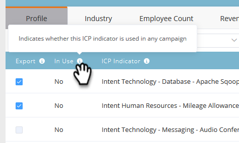
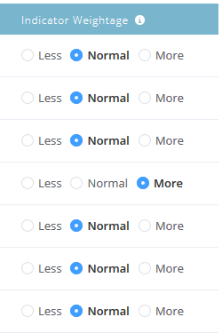

# 계정 프로파일링 순위 및 조정 {#account-profiling-ranking-and-tuning}

계정 프로파일링은 ICP(Ideal Customer Profile)를 식별하고, ICP를 기준으로 데이터베이스의 회사 등급을 지정하며, ICP 지표 데이터를 명명 계정으로 승격된 계정에 추가합니다.

## 모델 결과 {#model-results}

결과는 등급별로 분류된 모든 알려진 계정을 보여줍니다. A는 최고 등급이고, D는 최저 등급이다.

선택 사항이지만 자동 승격 확인란을 선택하는 것이 좋습니다. 이렇게 하면 시간이 많이 절약되기 때문입니다. 그러나 각 계정을 살펴보고 [수동으로 추가](/help/marketo/product-docs/target-account-management/target/named-accounts/discover-accounts.md#discover-crm-accounts)하려면 상자를 선택하지 않은 상태로 두면 됩니다.

<table> 
 <tbody> 
  <tr> 
   <td><strong>순위</strong></td> 
   <td> 
    

      이상적인 고객 프로필을 기반으로 한 계정 순위. A가 가장 적합하고 D가 가장 적다. 
    
</td> 
  </tr> 
  <tr> 
   <td><strong>성향</strong></td> 
   <td> 
    

      비ICP 기반 계정 선택과 비교하여 예상되는 전환율 증가. 
    
</td> 
  </tr> 
  <tr> 
   <td><strong>계정 (%)</strong></td> 
   <td> 
    

      모델 입력의 해당 등급이 있는 계정의 백분율입니다. 
    
</td> 
  </tr> 
  <tr> 
   <td><strong>모델 기준 %</strong></td> 
   <td> 
    

      모델 기준 계정 중 이 등급을 가진 계정의 백분율입니다. 
    
</td> 
  </tr> 
 </tbody> 
</table>

## 모델 조정 {#model-tuning}

모델(Model) 탭에서 모델 조정(Tune Model) 단추를 클릭합니다.

선택할 수 있는 여러 탭이 있어 심층적인 맞춤화를 가능하게 합니다.

**지표 범주**

<table> 
 <tbody> 
  <tr> 
   <td><strong>규정 준수</strong></td> 
   <td> 
    

      인증, 규정 준수 관련 직책/채용. 
    
</td> 
  </tr> 
  <tr> 
   <td><strong>작업</strong></td> 
   <td> 
    

      운영 관련 직책/채용. 
    
</td> 
  </tr> 
  <tr> 
   <td><strong>시간</strong></td> 
   <td> 
    

      HR 또는 Payroll 소프트웨어, HR 관련 직책/채용.
    
</td> 
  </tr> 
  <tr> 
   <td><strong>엔지니어링</strong></td> 
   <td> 
    

      기술, 프레임워크, 엔지니어링 관련 직책/채용. 
    
</td> 
  </tr> 
  <tr> 
   <td><strong>판매</strong></td> 
   <td> 
    

      영업, 영업 관련 직책/채용을 위한 솔루션 및 소프트웨어. 
    
</td> 
  </tr> 
  <tr> 
   <td><strong>의도</strong></td> 
   <td> 
    

      의도 표시기. 
    
</td> 
  </tr> 
  <tr> 
   <td><strong>IT</strong></td> 
   <td> 
    

      하드웨어 및 소프트웨어 솔루션, 기술, IT 관련 직책/채용.
    
</td> 
  </tr> 
  <tr> 
   <td><strong>재무</strong></td> 
   <td> 
    

      금융 소프트웨어, 금융 관련 직책/채용. 
    
</td> 
  </tr> 
  <tr> 
   <td><strong>마케팅</strong></td> 
   <td> 
    

      마케팅 기술 및 소프트웨어, 마케팅 관련 직책/채용. 
    
</td> 
  </tr> 
  <tr> 
   <td><strong>비즈니스</strong></td> 
   <td> 
    

      Forbes 또는 Inc 목록 또는 비즈니스 파트너십 
    
</td> 
  </tr> 
  <tr> 
   <td><strong>고객 경험 및 관계</strong></td> 
   <td> 
    

      고객 성공 및 고객 관계 직책/채용.
    
</td> 
  </tr> 
 </tbody> 
</table>

도구 설명에 마우스를 가져다 대면 각 열에 대한 설명이 표시됩니다.

ICP 지표 추가 드롭다운을 클릭하여 모델에 추가 지표를 삽입합니다.

[내보내기] 상자를 선택하면 [명명된 계정 세부 정보] 페이지에서 ICP 지표를 볼 수 있으며 [명명된 계정 필터](/help/marketo/product-docs/target-account-management/engage/account-filters.md)에서 선택한 ICP 지표를 제약 조건으로 사용할 수 있습니다.

>[!NOTE]
>
>ICP 지표는 **명명된 계정의 구성원** 필터 및 트리거에 제약 조건으로 포함됩니다.

지표 가중치는 각 지표가 모델에서 받는 중요도를 제어하는 것입니다.

모델 새로 고침 을 클릭하여 변경 사항을 적용합니다.

모델을 새로 고친 후 조정을 완료하면 모델 결과 탭으로 돌아가서 **순위 저장 및 적용**&#x200B;을 클릭합니다.

