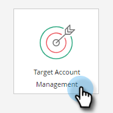

# 새 계정 검색 {#new-account-discovery}

새 계정 검색을 사용하면 이상적인 고객 프로필에서 AI 기반 권장 사항을 사용하여 타깃팅할 새 계정을 찾는 데 도움이 될 수 있습니다.

>[!IMPORTANT]
>
>2025년 현재는 새 사용자에 대해 계정 프로파일링을 더 이상 사용할 수 없습니다. 기존 사용자에 대해 계속 작동합니다.

>[!PREREQUISITES]
>
>[계정 프로파일링 설정](/help/marketo/product-docs/target-account-management/account-profiling/setting-up-account-profiling.md)

>[!TIP]
>
>새 계정 검색을 수행하기 전에 **기존 계정 업데이트** 단추를 눌러 최신 데이터를 확인하는 것이 좋습니다. 이 업데이트는 최대 24시간 소요될 수 있습니다.

1. 내 Marketo에서 **계정 관리 대상**&#x200B;을 클릭합니다.

   

1. **계정 프로파일링** 탭을 클릭합니다.

   

1. **새 계정** 탭을 클릭합니다.

   

   >[!NOTE]
   >
   >새 계정 은(는) 아직 TAM에서 내 계정이 아닌 계정 목록을 표시합니다. 선택하는 필터에 따라 새로운 기능을 제공할 수 있는 계정입니다.

1. 적용 가능한 필터를 모두 선택합니다(이 부분은 사용자 정의가 용이하며 필터링에 대한 예는 다음과 같습니다).

   

1. 페이지 오른쪽 하단의 **모두 저장 및 목록 만들기**&#x200B;를 클릭합니다.

   

   >[!NOTE]
   >
   >원하는 계정이 몇 개만 표시되면 개별 계정을 클릭하고 **선택한 계정 저장**&#x200B;을 클릭할 수 있습니다.

1. 목록을 자신의 새 계정 목록으로 만들거나 기존 계정 목록에 추가할 수 있습니다. 이 예제에서는 새 ID를 만듭니다.

   

   >[!NOTE]
   >
   >기존 계정 목록에 저장하려면 해당 옵션을 선택하고 드롭다운을 클릭한 다음 원하는 계정 목록을 선택하고 **다음**&#x200B;을 클릭합니다.

1. **저장**&#x200B;을 클릭합니다.

   

   >[!NOTE]
   >
   >한 번에 최대 5,000개의 계정만 저장할 수 있습니다. 검색 결과가 10,000개인 경우 첫 번째(상위) 5,000개를 저장한 다음 필터를 재설정하고 다음 5,000개를 저장해야 합니다. **총** 계정 제한은 백만 개입니다.

1. **확인**&#x200B;을 클릭합니다.

   

   >[!TIP]
   >
   >계정이 저장되면 LinkedIn[&#128279;](/help/marketo/product-docs/target-account-management/target/create-an-account-matched-audience-on-linkedin.md)에서 일치하는 대상을 사용하여 대상을 타깃팅할 수 있습니다.
