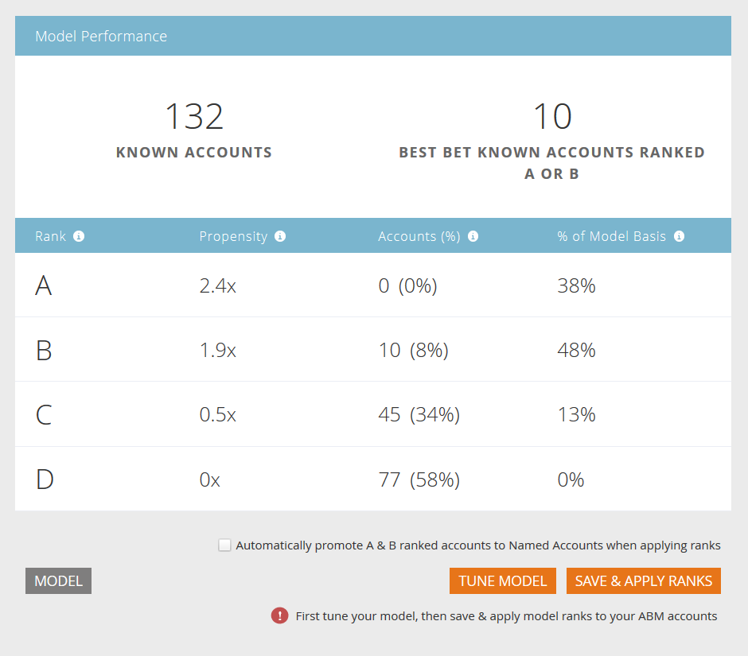

# 계정 프로파일링 설정 {#setting-up-account-profiling}

계정 프로파일링을 사용하려면 다음 단계를 따르십시오.

>[!IMPORTANT]
>
>2025년 현재는 새 사용자에 대해 계정 프로파일링을 더 이상 사용할 수 없습니다. 기존 사용자에 대해 계속 작동합니다.

>[!CAUTION]
>
>계정 프로파일링이 제대로 작동하려면 다음 필드를 **not**&#x200B;해야 합니다.
>
>* 웹 사이트
>* 회사
>* 이메일
>* 국가
>
>여기에서 [필드 숨김을 취소](/help/marketo/product-docs/administration/field-management/hide-and-unhide-a-field.md#unhide-a-field)하는 방법을 알아보세요.

1. 내 Marketo에서 **Target 계정 관리**&#x200B;를 엽니다.

   

1. **계정 프로파일링** 탭을 클릭합니다.

   

1. 기본적으로 모델(Model) 탭이 열립니다. **시작하기**&#x200B;를 클릭합니다.

   

1. 모델의 이름을 지정하고 이상적인 고객 프로필(ICP)의 기반으로 사용할 사람의 목록 유형/목록을 선택하십시오. 완료되면 **모델 만들기**&#x200B;를 클릭합니다.

   

1. 모델이 빌드를 시작합니다. 시간이 좀 걸리겠지만 걱정하지 마세요, 다 되면 알려 드리겠습니다.

   

1. 모델의 결과를 보려면 **모델 결과 보기**&#x200B;를 클릭하십시오.

   

   이제 모델이 생성됩니다.

   

   >[!TIP]
   >
   >모델이 만들어졌으므로 [조정하는 방법을 알아보세요](/help/marketo/product-docs/target-account-management/account-profiling/account-profiling-ranking-and-tuning.md).
