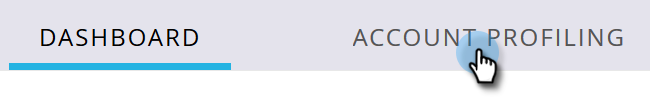

# 계정 프로파일링 설정 {#setting-up-account-profiling}

계정 프로파일링을 사용하려면 다음 단계를 따르십시오.

>[!CAUTION]
>
>다음 필드는 다음과 같아야 합니다 **아님** 계정 프로파일링이 제대로 작동하려면 를 숨깁니다.
>
>* 웹 사이트
>* 회사
>* 이메일
>* 국가
>
>방법 알아보기 [여기에서 필드 숨기기 취소](/help/marketo/product-docs/administration/field-management/hide-and-unhide-a-field.md#unhide-a-field).

1. 내 Marketo에서 을 엽니다. **Target 계정 관리**.

   

1. 다음을 클릭합니다. **계정 프로파일링** 탭.

   

1. 기본적으로 모델(Model) 탭이 열립니다. 클릭 **시작**.

   

1. 모델의 이름을 지정하고 이상적인 고객 프로필(ICP)의 기반으로 사용할 사람의 목록 유형/목록을 선택하십시오. 클릭 **모델 만들기** 완료 시.

   

1. 모델이 빌드를 시작합니다. 시간이 좀 걸리겠지만 걱정하지 마세요, 다 되면 알려 드리겠습니다.

   

1. 모델의 결과를 보려면 **모델 결과 보기**.

   

   이제 모델이 생성됩니다.

   

   >[!TIP]
   >
   >모델이 만들어졌으니, [조정 방법 알아보기](/help/marketo/product-docs/target-account-management/account-profiling/account-profiling-ranking-and-tuning.md).
