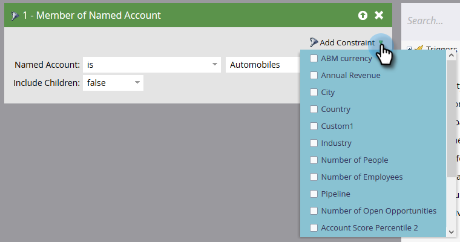

# 계정 필터 {#account-filters}

새로운 계정 중심 필터를 사용하여 지정된 계정 및 해당 계정 내의 가상 사용자를 식별하고 참여합니다.

## TAM 필터 {#tam-filters}

1. 스마트 캠페인을 선택하고 **스마트 목록**&#x200B;을 클릭하세요.

   

1. **+**&#x200B;을(를) 클릭하여 **계정 필터** 폴더를 확장합니다.

   

1. 사용할 필터를 캔버스로 드래그합니다.

   

## 계정 구성원 목록 {#member-of-account-list}

이 필터를 사용하려면 계정 목록 드롭다운을 클릭합니다.

...및 원하는 계정 목록을 선택합니다.

>[!NOTE]
>
>계정 목록 구성원 필터에는 &quot;is&quot; 한정자만 있습니다. 추가 한정자(예: &quot;is not&quot; 및 &quot;is any&quot;)는 사용할 수 없습니다.

## 명명된 계정의 구성원 {#member-of-named-account}

먼저 구분자를 선택합니다. 특정 명명된 계정의 **Is** 또는 명명된 계정의 **is**.

명명된 계정 드롭다운을 클릭합니다.

...및 원하는 명명된 계정을 선택합니다.

&quot;is any&quot; 한정자를 사용하는 경우 [제약 조건](/help/marketo/product-docs/core-marketo-concepts/smart-lists-and-static-lists/using-smart-lists/add-a-constraint-to-a-smart-list-filter.md)을 사용하여 검색 결과를 좁힐 수 있습니다. 원하는 만큼 추가합니다.

최상위 단일 계정의 멤버만 원하는 경우 &quot;하위 포함&quot;을 false로 설정합니다. 모든 하위 계정의 멤버를 원하는 경우 true를 선택합니다.

>[!MORELIKETHIS]
>
>[계정 트리거](/help/marketo/product-docs/target-account-management/engage/account-triggers.md)
