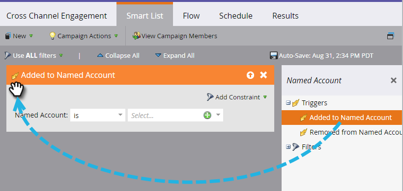

# 계정 트리거 {#account-triggers}

계정 수준 트리거를 사용하여 다양한 채널(예: 이메일, 웹, 광고)에서 중요한 계정 수준 행동 활동을 듣고 수행합니다.

스마트 캠페인을 선택하고 **[!UICONTROL Smart List]**&#x200B;을(를) 클릭합니다.

[!UICONTROL Named Account] 트리거를 모두 찾으려면 검색 상자에 &quot;[!UICONTROL Named Account]&quot;을(를) 입력하십시오.

원하는 트리거를 캔버스로 드래그합니다. 이 예제에서는 _[!UICONTROL Added to Named Account]_을(를) 사용합니다.

구분자를 선택합니다.

명명된 계정 드롭다운을 클릭합니다.

...및 원하는 명명된 계정을 선택합니다.

됐습니다. 스마트 캠페인의 나머지 부분을 완료한 후 활성화해야 합니다.

>[!MORELIKETHIS]
>
>[계정 필터](/help/marketo/product-docs/target-account-management/engage/account-filters.md)
