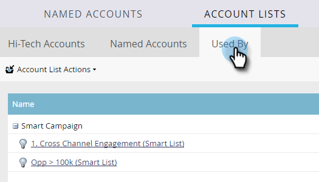

# 계정 목록 통찰력 {#account-list-insights}

계정 목록 대시보드는 해당 목록 내의 명명된 모든 계정에서 집계된 인사이트 보기를 제공합니다.

>[!NOTE]
>
>Marketo TAM은 생성된 파이프라인 또는 계정 참여 점수를 기반으로 계정 목록 내에서 상위 명명 계정을 자동으로 결정합니다.

## 계정 목록 대시보드 {#account-list-dashboard}

계정 목록의 대시보드를 보려면 해당 이름을 클릭하면 됩니다.

...대시보드가 나타납니다.

<table> 
 <tbody> 
  <tr> 
   <td colspan="1"><strong>파이프라인</strong></td> 
   <td colspan="1">시간이 지남에 따라 파이프라인을 참조하십시오. 주별로 시간이 지남에 따라 파이프라인을 결정하기 위해 우리는 마지막 날에 파이프라인을 취합니다.</td> 
  </tr> 
  <tr> 
   <td><strong>매출</strong></td> 
   <td>
시간 경과에 따른 매출 을 참조하십시오. 주별로 수익을 정하기 위해, 우리는 그 주의 모든 수입의 합계를 구합니다.
</td> 
  </tr> 
 </tbody> 
</table>

## 명명된 계정 탭 {#named-accounts-tab}

을(를) 클릭합니다. **명명된 계정** 탭하여 해당 계정 목록에 속하는 명명 계정을 확인합니다.

>[!NOTE]
>
>이 탭에서 명명된 계정을 선택하고 을 클릭하여 제거할 수 있습니다 **명명된 계정 제거**.

## 탭에서 사용 {#used-by-tab}

을(를) 클릭합니다. **사용자** 탭하여 해당 계정 목록을 참조하는 자산을 확인합니다.

