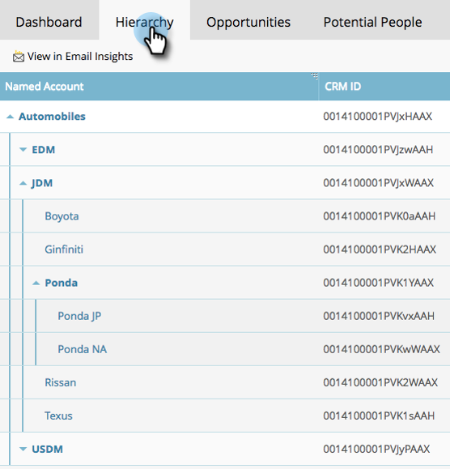

# 명명된 계정 통찰력 {#named-account-insights}

지정된 계정 대시보드는 대상 계정에 대한 360도 보기를 제공합니다.

## 대시보드 {#dashboard}

대시보드는 명명된 계정 내의 모든 사람으로부터 계정 수준에서 주요 인사이트를 집계하므로 각 사람에게 이동하여 진행 상황을 평가할 필요가 없습니다. 을 사용하여 이메일 활동에 대해 자세히 드릴다운할 수 있습니다 [이메일 통찰력](/help/marketo/product-docs/reporting/email-insights/filtering-in-email-insights.md#account-based-marketing).

>[!NOTE]
>
>차트는 지난 90일의 통찰력을 보여줍니다.

**시간에 따른 계정 참여** 을(를) 클릭합니다. **보기** 표시되는 내용을 변경하려면 오른쪽의 드롭다운을 클릭하십시오. 계정 점수 외에 총 매출액...별로 볼 수 있습니다.

...또는 파이프라인.

<table> 
 <tbody> 
  <tr> 
   <td><strong>계정 점수</strong></td> 
   <td>
관리자에서 만든 모든 계정 점수를 기반으로 매주 참여를 참조하십시오. 이 계정 점수를 나란히 비교할 수 있습니다. 주간 참여를 결정하기 위해 우리는 그 주의 어느 요일이든 최대 참여를 받습니다.
</td> 
  </tr> 
  <tr> 
   <td><strong>파이프라인</strong></td> 
   <td>시간이 지남에 따라 파이프라인을 참조하십시오. 주별로 시간이 지남에 따라 파이프라인을 결정하기 위해 우리는 마지막 날에 파이프라인을 취합니다.</td> 
  </tr> 
  <tr> 
   <td><strong>매출</strong></td> 
   <td>시간 경과에 따른 매출 을 참조하십시오. 주별로 수익을 정하기 위해, 우리는 그 주의 모든 수입의 합계를 구합니다.</td> 
  </tr> 
 </tbody> 
</table>

**흥미로운 순간**

Marketo Sales Insight 사용자가 사용할 수 있는 계정 수준에서 롤업된 흥미로운 순간을 확인할 수 있습니다.

**상위 사람**

이 사람들은 명명된 계정 사용자가 보여준 최신성 또는 시급성을 기반으로 하는 우선순위(와 동일함)를 기반으로 계산됩니다 [최고의 선택](/help/marketo/product-docs/marketo-sales-insight/msi-for-salesforce/features/stars-and-flames/priority-urgency-relative-score-and-best-bets.md) Sales Insight)나 사용자가 정의한 점수입니다. **우선순위** Marketo Sales Insight 사용자만 사용할 수 있습니다.

**하위 포함**

클릭 **하위 포함** 선택된 명명 계정의 하위 계정을 보고 선택하고 합계 분석을 보려면 해당 계정을 사용하십시오.

>[!NOTE]
>
>계정을 선택할 때 모두 선택하거나 최대 100개를 개별적으로 선택할 수 있습니다.

## 계층 {#hierarchy}

선택한 명명된 계정이 해당 계층 구조와 관련하여 어디에 있는지 확인합니다.

## 기회 {#opportunities}

계정 수준에서 열린 모든 기회에 대한 롤업 보기를 통해 마케팅 팀이 특정 기회를 종료하는데 집중할 수 있습니다.

## 잠재 사용자 {#potential-people}

Lead-to-Account 매칭은 Fuzzy 로직을 사용하여 Potential People 탭에서 해결할 수 있는 약한 일치를 찾습니다.

>[!NOTE]
>
>나열된 사람을 추가하려면 해당 사용자를 선택하고 **사용자 추가**.

## 사용자 {#used-by}

이 탭에는 현재 특정 명명 계정 또는 계정 목록을 참조하는 스마트 캠페인, 웹 캠페인, 스마트 목록 또는 보고서가 표시됩니다.

## 계정 팀 {#account-team}

이 탭에서 계정 소유자를 할당하더라도 계정 팀 구성원을 보고 구성원을 추가/제거합니다.

>[!NOTE]
>
>을(를) 클릭합니다. **계정 팀 작업** 계정 구성원을 추가/제거하거나 계정 소유자를 지정하려면 드롭다운을 선택합니다.

## ICP 표시기 {#icp-indicators}

내보낼 때 선택한 ICP 표시기 보기 [모델을 조정했습니다](/help/marketo/product-docs/target-account-management/account-profiling/account-profiling-ranking-and-tuning.md#model-tuning).

