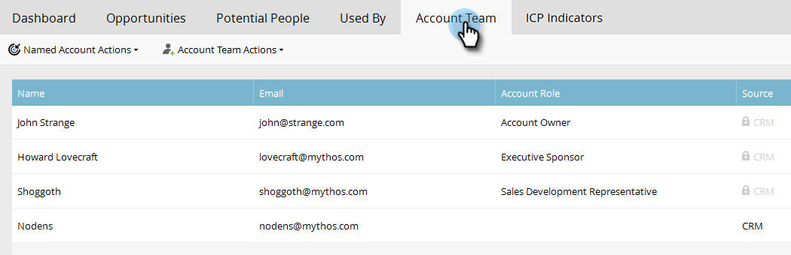

# 명명된 계정 인사이트 {#named-account-insights}

명명된 계정 대시보드는 대상 계정에 대한 360도 보기를 제공합니다.

## 대시보드 {#dashboard}

대시보드는 명명된 계정 내의 모든 사람으로부터 계정 수준에서 주요 인사이트를 집계하므로 각 사람에게 진행 상황을 평가하러 가지 않아도 됩니다. [이메일 인사이트](/help/marketo/product-docs/reporting/email-insights/filtering-in-email-insights.md#account-based-marketing)를 사용하여 이메일 활동에 대해 자세히 살펴볼 수 있습니다.

>[!NOTE]
>
>차트는 지난 90일의 통찰력을 보여 줍니다.

**시간 경과에 따른 계정 참여** 오른쪽의 **보기** 드롭다운을 클릭하여 표시되는 내용을 변경합니다. 계정 점수 외에 총 매출액별로 볼 수 있습니다.

...또는 파이프라인

<table> 
 <tbody> 
  <tr> 
   <td><strong>계정 스코어</strong></td> 
   <td>
관리자에서 만든 모든 계정 점수를 기반으로 한 주별 참여 를 참조하십시오. 이러한 계정 점수를 나란히 비교할 수 있습니다. 주별 참여를 결정하기 위해 해당 주의 모든 요일에서 최대 참여를 선택합니다.
</td> 
  </tr> 
  <tr> 
   <td><strong>파이프라인</strong></td> 
   <td>시간이 지남에 따라 파이프라인을 봅니다. 주별로 시간에 따른 파이프라인을 결정하기 위해 마지막 날에 파이프라인을 사용합니다.</td> 
  </tr> 
  <tr> 
   <td><strong>매출</strong></td> 
   <td>시간 경과에 따른 매출을 확인하십시오. 주별로 시간에 따른 매출을 결정하기 위해 해당 주에 발생한 모든 매출의 합계를 구합니다.</td> 
  </tr> 
 </tbody> 
</table>

**관심 있는 순간**

Marketo Sales Insight 사용자가 사용할 수 있으며, 계정 수준에서 롤업된 흥미로운 순간을 참조하십시오.

**상위 사용자**

이러한 인원은 명명 계정(Sales Insight의 [최고 베팅](/help/marketo/product-docs/marketo-sales-insight/msi-for-salesforce/features/stars-and-flames/priority-urgency-relative-score-and-best-bets.md)과 동일) 사용자가 표시한 최신성 또는 긴급성을 기반으로 한 우선 순위 또는 사용자가 정의한 점수를 기반으로 계산됩니다. **우선 순위**&#x200B;는 Marketo Sales Insight 사용자만 사용할 수 있습니다.

**하위 항목 포함**

**하위 항목 포함**&#x200B;을 클릭하여 선택한 명명된 계정의 하위 계정을 확인 및 선택하고 해당 집계 분석을 봅니다.

>[!NOTE]
>
>계정을 선택할 때 모두 선택을 선택하거나 개별적으로 최대 100개를 선택할 수 있습니다.

## 계층 {#hierarchy}

선택한 명명된 계정이 해당 계층 구조와 관련하여 어디에 있는지 확인합니다.

## 기회 {#opportunities}

계정 수준에서 열려 있는 모든 기회에 대한 롤업 보기를 통해 마케팅 팀이 특정 기회를 종료하는 데 집중할 수 있습니다.

## 잠재적 사람 {#potential-people}

리드-계정 일치는 퍼지 로직을 사용하여 잠재적 사용자 탭에서 해결할 수 있는 취약한 일치를 찾습니다.

>[!NOTE]
>
>나열된 직원을 추가하려면 해당 직원을 선택하고 **직원 추가**&#x200B;를 클릭하세요.

## 사용한 사람 {#used-by}

이 탭에는 현재 특정 명명 계정 또는 계정 목록을 참조하는 스마트 캠페인, 웹 캠페인, 스마트 목록 또는 보고서가 표시됩니다.

## 계정 팀 {#account-team}

이 탭에서 계정 팀원을 보고, 구성원을 추가/제거하고, 계정 소유자를 할당합니다.

>[!NOTE]
>
>계정 구성원을 추가/제거하거나 계정 소유자를 할당하려면 **계정 팀 작업** 드롭다운을 클릭하십시오.

## ICP 지표 {#icp-indicators}

[모델을 조정](/help/marketo/product-docs/target-account-management/account-profiling/account-profiling-ranking-and-tuning.md#model-tuning)할 때 내보내도록 선택한 ICP 지표를 봅니다.

