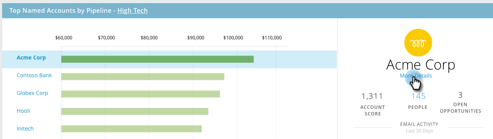

# TAM 기본 대시보드 {#tam-main-dashboard}

기본 대시보드는 Target 계정 관리 작업에 대한 요약을 제공합니다. 성공을 보여주는 타겟 계정 또는 계정 목록과 더 많은 주의가 필요한 계정을 볼 수 있습니다.

계정 목록을 기준으로 필터링하려면 보기 드롭다운을 클릭합니다.

...선택한 항목을 선택합니다. 이 예제에서는 &quot;첨단 기술&quot; 계정 목록을 선택합니다.

를 보려면 [계정 목록 대시보드](/help/marketo/product-docs/target-account-management/measure/account-list-insights.md#account-list-dashboard)선택한 계정 목록의 이름을 클릭합니다.

...대시보드가 로드됩니다.

지정된 계정으로 드릴다운할 계정 목록 대시보드를 보는 대신 를 클릭합니다 **더 자세히** 이름 아래..

...그리고 [명명된 계정의 통찰력](/help/marketo/product-docs/target-account-management/measure/named-account-insights.md).

