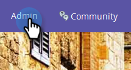
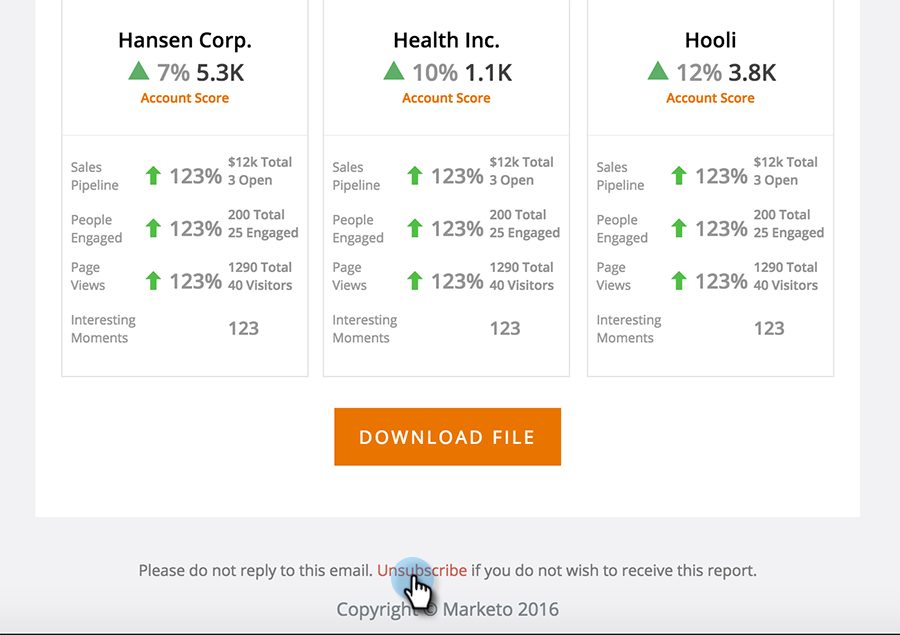

# TAM 보고서 설정 {#tam-report-setup}

TAM Sales Report 는 계정 팀에게 매주 전송되는 개인화된 이메일입니다.

## 보고서 설정 {#report-setup}

1. **[!UICONTROL Admin]**&#x200B;을(를) 클릭합니다.

   

1. **[!UICONTROL Target Account Management]**&#x200B;을(를) 클릭합니다.

   

1. [!UICONTROL Weekly Report]에서 **[!UICONTROL Edit]**&#x200B;을(를) 클릭합니다.

   

1. **[!UICONTROL Day]** 드롭다운을 클릭하고 받는 사람이 전자 메일을 받을 요일을 선택합니다.

   

1. 전자 메일 레이아웃을 확인하려면 **[!UICONTROL Sort By]** 드롭다운을 클릭하고 선택합니다.

   

1. **[!UICONTROL Users]** 확인란을 선택한 다음 드롭다운을 클릭하고 전자 메일을 받을 사용자를 선택합니다.

   

   >[!NOTE]
   >
   >알림은 계정 소유자 또는 팀원에게만 전송됩니다.

1. **[!UICONTROL Save]**&#x200B;을(를) 클릭합니다.

   

다 됐습니다!

## 구독을 취소하는 방법 {#how-to-unsubscribe}

각 보고서에는 옵트아웃 옵션이 제공됩니다. 이렇게 하려면 전자 메일 하단의 **[!UICONTROL Unsubscribe]**&#x200B;을(를) 클릭하면 됩니다.

## 재가입 방법 {#how-to-resubscribe}

1. **[!UICONTROL Admin]**&#x200B;을(를) 클릭합니다.

   

1. **[!UICONTROL Target Account Management]**&#x200B;을(를) 클릭합니다.

   

1. [!UICONTROL Weekly Report]에서 [!UICONTROL Unsubscribed]&#x200B;(으)로 나열된 숫자를 클릭합니다.

   

1. **[!UICONTROL Users]** 드롭다운을 클릭합니다.

   

1. 전자 메일을 다시 받을 사용자를 선택하고 **[!UICONTROL Resubscribe]**&#x200B;을(를) 클릭합니다.

   
