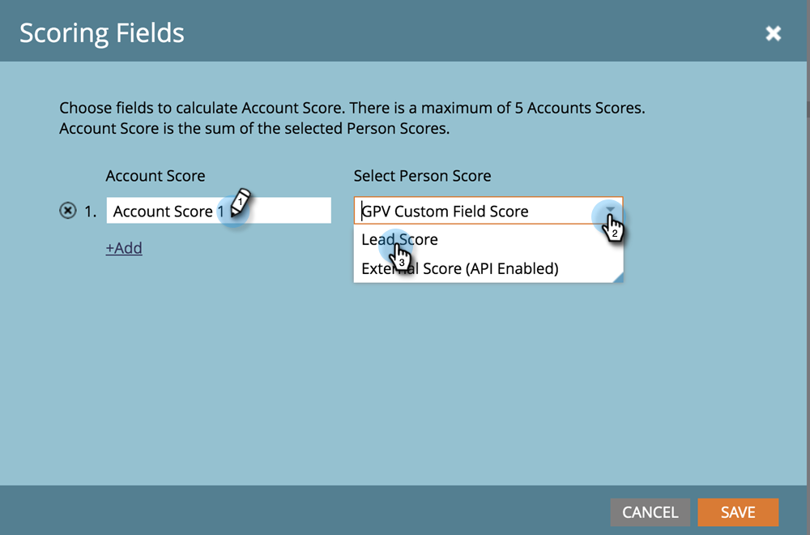

# [!UICONTROL Account Score] {#account-score}

계정 점수는 [!UICONTROL Target Account Management]의 중요한 부분입니다. 계정의 참여 수준을 결정하는 데 도움이 됩니다.

## 계정 점수부여란 무엇입니까? {#what-is-account-scoring}

이는 영업 및 마케팅 팀이 구매 가능성이 가장 높은 기업(잠재 고객 포함)을 식별하고 우선 순위를 지정할 수 있도록 고안된 체계적인 접근 방식입니다.

B2B 구매 프로세스가 복잡한 환경에서는 한 개인이 구매 결정을 내리는 경우는 거의 없습니다. 각각 자신의 욕구를 지닌 다양한 역할이 수반되는 경우가 많다. 계정 기반 점수는 여러 잠재 고객의 잠재 고객 점수를 집계하고 계정 수준에서 점수를 제공하여 이를 고려합니다.

## 일반적인 예 {#common-examples}

<table>
 <tbody>
  <tr>
   <td><strong>계정 참여 점수</strong></td>
   <td>특정 타겟 계정에 있는 사람들의 다양한 채널(예: 이메일, 웹, 광고)에서 추적된 행동 활동을 기반으로 한 참여의 깊이입니다.</td>
  </tr>
  <tr>
   <td><strong>계정 제품 관심 점수</strong></td>
   <td>특정 제품의 콘텐츠에 관심을 보이는 타겟 계정 사용자(예: 백서 다운로드).</td>
  </tr>
  <tr>
   <td><strong>계정 웹 참여 점수</strong></td>
   <td>웹 채널을 방문하는 타겟 계정 사용자. 이메일, 광고 또는 기타 채널에서 채널 참여를 측정하기 위해 동일한 점수를 만들 수 있습니다.</td>
  </tr>
 </tbody>
</table>

## 계정 점수를 구성하는 방법 {#how-to-configure-account-score}

>[!NOTE]
>
>계정 점수를 계산하려면 먼저 리드 점수를 생성해야 합니다. Marketo TAM은 자동으로 리드 점수를 계정 점수로 집계합니다. 예를 들어 위의 두 가지 예(_계정 제품 관심도 점수_ 및 _계정 웹 참여 점수_)를 사용합니다.
>
>먼저 대상 계정의 각 잠재 고객의 관련 세부 정보를 캡처하는 잠재 고객 스코어 필드를 만듭니다.
>&#x200B;>그런 다음 해당 리드 점수를 해당 계정 점수에 할당합니다.
>&#x200B;>계정 제품 이자 점수 = SUM(잠재 고객 제품 이자 점수)
>&#x200B;>계정 웹 참여 점수 = SUM(잠재 고객 웹 참여 점수)

>[!NOTE]
>
>사용자는 여러 계정 참여 점수를 만들고 다른 개인 점수를 다른 계정 점수에 할당할 수 있습니다.

잠재 고객 점수를 구성한 후 아래 단계를 따라 진행하십시오.

1. **[!UICONTROL Admin]**&#x200B;을(를) 클릭합니다.

   

1. **[!UICONTROL Target Account Management]**&#x200B;을(를) 클릭합니다.

   

1. [!UICONTROL Scoring Fields]에서 **[!UICONTROL Edit]**&#x200B;을(를) 클릭합니다.

   

   >[!NOTE]
   >
   >최대 **5개** 필드를 선택하여 [!UICONTROL Account Score]을(를) 계산할 수 있습니다.

1. [!UICONTROL Account Score] 이름을 입력하고 **[!UICONTROL Select Person Score]** 드롭다운을 클릭한 다음 해당 점수를 선택하십시오.

   

1. 점수를 더 추가하려면 **[!UICONTROL +Add]**&#x200B;을(를) 클릭하십시오.

   

1. 원하는 점수를 모두 추가합니다. 완료되면 **[!UICONTROL Save]**&#x200B;을(를) 클릭합니다.

   
