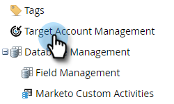

# 계정 팀 설정 {#account-team-setup}

계정 팀은 명명 계정에 대해 함께 작업하는 관련자 그룹입니다. 다음 단계에 따라 추가해야 하는 CRM 계정 역할을 선택하십시오.

1. **[!UICONTROL Admin]**&#x200B;을(를) 클릭합니다.

   

1. **[!UICONTROL Target Account Management]**&#x200B;을(를) 클릭합니다.

   

1. 계정 팀원 아래에서 **[!UICONTROL Edit]**&#x200B;을(를) 클릭합니다.

   

   >[!NOTE]
   >
   >[!UICONTROL Account Role]의 경우 이름을 지정하고 CRM의 원하는 사용자 조회 필드에 연결합니다.

1. [!UICONTROL Account Role] 이름을 입력하고 **CRM** 필드를 선택합니다. 최대 10개까지 추가할 수 있습니다.

   

   >[!NOTE]
   >
   >[!UICONTROL Account Owner]을(를) 선택할 수 없습니다. CRM의 계정 수준에서 기본적으로 선택됩니다.

1. 완료되면 **[!UICONTROL Save]**&#x200B;을(를) 클릭합니다.

   

   >[!CAUTION]
   >
   >업데이트하는 경우 변경 사항이 TAM에 반영되기까지 다소 시간이 걸릴 수 있습니다.

   >[!NOTE]
   >
   >* 계정 소유자가 다른 여러 CRM 계정이 명명된 계정에 병합되면 Marketo에서는 한 개의 &quot;계정 소유자&quot;를 선택하고 다른 계정 소유자를 &quot;계정 공동 소유자&quot;로 추가합니다.
   >
   >* CRM &quot;역할&quot; 필드의 이름이 나중에 변경되거나 삭제되면 사용자가 TAM에서 설정을 수동으로 업데이트할 때까지 Marketo TAM은 업데이트된 값의 동기화를 중지합니다
