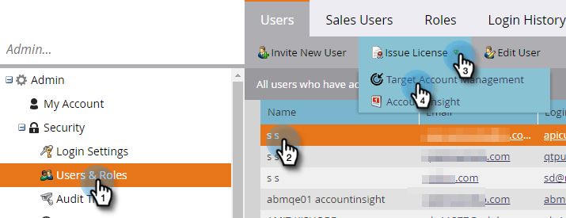

# 라이선스 발급 {#issue-a-license}

TAM을 사용하려면 사용자에게 라이선스를 설정해야 합니다. 방법은 다음과 같습니다.

>[!NOTE]
>
>사용 가능한 라이선스의 수는 구독에 따라 달라집니다. 더 필요한 경우 영업 담당자에게 문의하십시오.

1. **[!UICONTROL Admin]**&#x200B;를 클릭합니다.

   

1. **[!UICONTROL Users & Roles]**&#x200B;을(를) 클릭합니다. 라이선스를 발급할 사용자를 선택하고 **[!UICONTROL Issue License]** 드롭다운을 클릭한 다음 **[!UICONTROL Target Account Management]**&#x200B;을(를) 선택합니다.

   

1. **[!UICONTROL Enable License]** 확인란을 선택하고 **[!UICONTROL Save]**&#x200B;을(를) 클릭합니다.

   

   >[!NOTE]
   >
   >사용자 라이선스를 제거하려면 1단계를 수행한 다음 확인란의 선택을 취소하고 **[!UICONTROL Save]**&#x200B;을(를) 클릭합니다.
