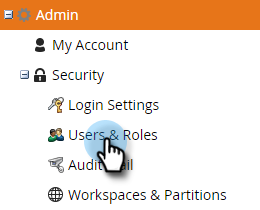

# 권한 {#permissions}

사용자가 TAM을 사용할 수 있도록 하려면 사용 권한을 설정해야 합니다. 방법은 다음과 같습니다.

1. 클릭 **관리**.

   

1. 클릭 **사용자 및 역할**.

   

   >[!NOTE]
   >
   >기존 역할에 대해 TAM 권한을 추가하거나 새 역할을 만들 수 있습니다. 이 예제에서는 새 역할을 사용합니다.

1. 클릭 **역할**, 그런 다음 **새 역할**.

   

1. 역할 이름 을 입력하고 **+** Target 계정 관리 확인란 옆에 있는 아이콘을 클릭합니다.

   

1. 선택하려면 다음을 수행하십시오 _모두_ 사용 권한을 확인하고 **액세스 Target 계정 관리** 확인란을 선택합니다.

   

   >[!NOTE]
   >
   >일부 옵션만 선택할 수 있습니다. 각 확인란을 개별적으로 선택하여 이 작업을 수행합니다.

1. 을(를) 클릭합니다. **+** 액세스 관리자 메뉴를 엽니다. 을(를) 확인합니다. **ABM 관리자에 액세스** 확인란(ABM은 TAM의 이전 이름)을 선택하고 **만들기**.

   

   이제 새로운 TAM 역할을 수행할 준비가 되었습니다. [사용자에게 할당](/help/marketo/product-docs/administration/users-and-roles/managing-user-roles-and-permissions.md#assign-roles-to-a-user)!
