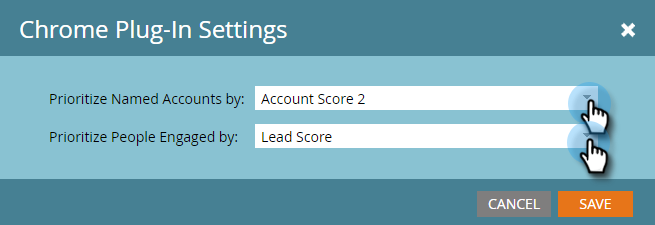

# 계정 인사이트 설정 {#set-up-account-insight}

계정 Insight을 설정하는 방법은 다음과 같습니다.

>[!PREREQUISITES]
>
>먼저 TAM 계정 점수 [을(를) 구성해야](/help/marketo/product-docs/target-account-management/setup-tam/account-score.md)합니다.

1. **[!UICONTROL Admin]**&#x200B;를 클릭합니다.

   

1. 트리에서 **[!UICONTROL Target Account Management]**&#x200B;을(를) 클릭한 다음 **[!UICONTROL Sales]** 탭을 클릭합니다.

   

1. **[!UICONTROL Edit]**&#x200B;를 클릭합니다.

   

1. 드롭다운을 클릭하여 계정 Insight이 명명 계정 및 참여 직원의 우선 순위를 지정하는 방법을 선택합니다.

   

   >[!NOTE]
   >
   >언제든지 [계정 점수 설정](/help/marketo/product-docs/target-account-management/setup-tam/account-score.md)이 업데이트되는 경우 관리자가 판매 아래의 구성을 업데이트하여 점수가 사용자의 기본 설정을 정확하게 반영하도록 해야 합니다. 변경 사항을 보려면 로그아웃한 후 다시 로그인해야 합니다.

1. **[!UICONTROL Save]**&#x200B;를 클릭합니다.

   
