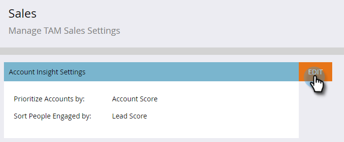

# 계정 인사이트 설정 {#set-up-account-insight}

계정 인사이트를 설정하는 방법은 다음과 같습니다.

>[!PREREQUISITES]
>
>TAM 계정 점수 [는 먼저 ](/help/marketo/product-docs/target-account-management/setup-tam/account-score.md)을 구성해야 합니다.

1. **관리**&#x200B;를 클릭합니다.

   

1. 트리에서 **Target 계정 관리**&#x200B;를 클릭한 다음 **판매** 탭을 클릭합니다.

   

1. **편집**&#x200B;을 클릭합니다.

   

1. 드롭다운을 클릭하여 Account Insight가 지정된 계정에 대한 우선 순위를 매기고 참여자를 유도하는 방법을 선택합니다.

   

   >[!NOTE]
   >
   >언제든지 [계정 점수 설정](/help/marketo/product-docs/target-account-management/setup-tam/account-score.md)이 업데이트되는 경우 관리자가 판매 아래의 구성을 업데이트하여 점수가 사용자의 기본 설정을 정확하게 반영하도록 해야 합니다. 사용자가 로그아웃한 후 다시 로그인하여 변경 내용을 확인합니다.

1. **저장**&#x200B;을 클릭합니다.

   
