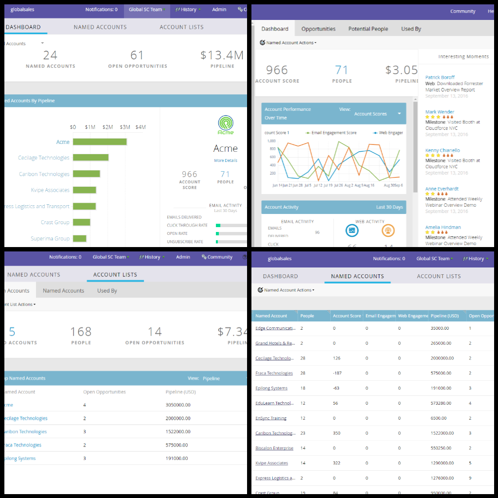

# 타겟 계정 관리 {#target-account-management-overview}

마케터, Target 계정 관리를 충족하십시오. 타겟 계정 관리에서 마케터를 만나보십시오.

Marketo Target 계정 관리란 무엇입니까?

Marketo Target Account Management 는 영업 팀과 마케팅 팀이 협력하여 매우 조정된 방식으로 주요 계정을 타겟팅하고 참여하도록 하므로, 계정 중심 전략, 실행 및 성공 간의 격차가 모두 단일 플랫폼 내에서 해결됩니다.

Marketo Target 계정 관리를 사용하는 이유

Marketo은 TAM과 리드 관리를 하나의 솔루션으로 통합하여 마케터가 하나의 동작으로 계정과 리드 모두에 대해 개인화된 캠페인을 쉽게 실행할 수 있도록 합니다. 또한 주요 의사 결정권자 및 거래 영향력자에게 연락하여 혜택을 얻을 수 있습니다.

Marketo TAM은 다음 세 가지 구성 요소로 구성됩니다.

**1) 대상**

* 계정 검색
* 리드-계정 일치
* 명명된 계정 목록

**2) 참여**

* 계정 기반 Personalization
* Cross-Channel Engagement
* 계정별 워크플로

**3) 측정값**

* 계정 및 목록 수준 인사이트
* 계정 참여 점수
* 파이프라인 및 수익 영향

Marketo 계정 기반 마케팅은 또한 여러 채널에서 명명된 계정 경험을 개인화할 수 있는 다양한 도구를 제공합니다.

* 이메일 및 랜딩 페이지 Personalization
* 웹 Personalization
* URL [Personalization](/help/marketo/product-docs/demand-generation/landing-pages/personalizing-landing-pages/enable-personalized-urls-for-your-account.md)
* 광고 [Personalization](/help/marketo/product-docs/demand-generation/facebook/create-a-custom-audience-in-facebook.md)
* [개인화됨](/help/marketo/product-docs/web-personalization/website-retargeting/retargeting-with-web-personalization-data.md) 리마케팅

나도 들어왔어! 시작하려면 어떻게 해야 합니까?

물어보지도 않을 줄 알았는데! TAM은 Marketo 구독의 추가 기능으로 사용할 수 있으므로, 이를 구현하려면 영업 담당자에게 문의하십시오. 이 문서를 받으면 [TAM 시작하기](/help/marketo/product-docs/target-account-management/setup-tam/getting-started-with-tam.md) 문서를 확인하십시오.

>[!NOTE]
>
>Marketo TAM에서 관리되는 지정 계정은 웹 개인화 요구 사항을 위해 웹 TAM에서 직접 액세스할 수 있습니다. [여기](/help/marketo/product-docs/web-personalization/account-based-web-marketing/account-based-web-marketing-with-tam.md)에서 자세히 알아보세요.

Marketo TAM에 오신 것을 환영합니다. 타깃팅된 마케팅을 즐겨주세요!
