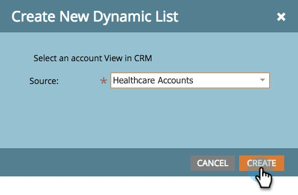

# 계정 목록 {#account-lists}

계정 목록은 함께 타겟팅할 수 있는 명명된 계정의 컬렉션입니다. 계정 목록을 사용하면 명명 계정을 업종, 위치 또는 회사 규모별로 타겟팅할 수 있습니다.

계정 목록 외에도 공개 CRM 계정 보기에서 생성된 동적 계정 목록을 만들 수도 있습니다. CRM 계정 보기는 계정을 표시할 때 필터 역할을 하는 규칙 세트입니다. 예를 들어, 산업 이 의료 서비스인 계정을 찾는 데 사용할 수 있습니다 *및* 매출은 1억 달러가 넘습니다.

>[!NOTE]
>
>Marketo Target 계정 관리에서 만든 계정 목록은에서 스마트 목록 및 웹 캠페인을 빌드할 때 자동으로 사용할 수 있습니다. [웹 개인화](/help/marketo/product-docs/web-personalization/using-web-segments/web-segments.md).

## 새 계정 목록 만들기 {#create-a-new-account-list}

1. 다음을 클릭합니다. **신규** 드롭다운 및 선택 **새 계정 목록 만들기**.

   

1. 목록에 이름을 지정하고 **만들기**.

   

1. 계정 목록을 만든 후 다음 작업을 시작하십시오. [명명된 계정을 추가합니다.](/help/marketo/product-docs/target-account-management/target/named-accounts/add-an-existing-named-account-to-an-account-list.md)!

   >[!NOTE]
   >
   >Marketo은 이름이 지정된 계정이 2,000개 이하인 계정 목록에 대한 인사이트만 표시합니다.

## 새 동적 계정 목록 만들기 {#create-a-new-dynamic-account-list}

1. 다음을 클릭합니다. **신규** 드롭다운 및 선택 **새 동적 목록 만들기**.

   

1. 대화 상자에서 **CRM 계정 보기** 을 클릭하거나 이름을 입력하여 검색합니다.

   

1. Click **Create**.

   

   >[!NOTE]
   >
   >Salesforce에서 동기화 사용자에게 목록 보기 개체 권한을 제공해야 합니다.

## 계정 목록 이름 바꾸기 {#rename-an-account-list}

>[!NOTE]
>
>이 단계는 계정 목록에만 적용됩니다. _동적_ 계정 목록은 연결된 CRM 계정 보기의 이름을 사용합니다.

1. 이름을 바꿀 계정을 선택하고 **계정 목록 작업** 드롭다운 및 선택 **계정 목록 이름 바꾸기**.

   

1. 새 이름을 입력하고 **이름 바꾸기**.

   

   >[!NOTE]
   >
   >CRM 계정 보기는 8시간마다 동적 계정 목록과 동기화됩니다. 아직 동기화되지 않은 경우 Marketo에서 다음 주기 동안 동기화합니다.

## 계정 목록 삭제 {#delete-an-account-list}

>[!NOTE]
>
>이러한 단계는 계정 목록과 동적 계정 목록에 대해 동일합니다.

1. 삭제할 계정을 선택하고 **계정 목록 작업** 드롭다운 및 선택 **계정 목록 삭제**.

   

1. 클릭 **삭제**.

   

>[!MORELIKETHIS]
>
>* [계정 목록에 기존의 명명된 계정 추가](/help/marketo/product-docs/target-account-management/target/named-accounts/add-an-existing-named-account-to-an-account-list.md)
>* [계정 목록 통찰력](/help/marketo/product-docs/target-account-management/measure/account-list-insights.md)
