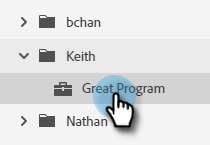

# 계정 스마트 목록 {#account-smart-lists}

다음은 고가치 계정을 빠르고 정확하게 식별하는 방법입니다.

>[!NOTE]
>
>이 기능은 [!UICONTROL Target Account Management] 추가 기능과 라이선스가 부여된 TAM이 모두 발급된 사용자만 사용할 수 있습니다.

## [!UICONTROL Account Smart List] 만들기 {#create-an-account-smart-list}

1. Marketo에서 **[!UICONTROL Marketing Activities]**(으)로 이동합니다.

   

1. 원하는 프로그램을 찾아 선택합니다.

   

1. **[!UICONTROL New]** 드롭다운을 클릭하고 **[!UICONTROL New Local Asset]**&#x200B;을(를) 선택합니다.

   

1. **[!UICONTROL Account Smart List]**&#x200B;을(를) 클릭합니다.

   

1. 이름을 입력하고 **[!UICONTROL Create]**&#x200B;을(를) 클릭합니다(설명 및 레이블은 선택 사항입니다).

   

[!UICONTROL Account Smart List]이(가) 만들어졌습니다! 해당 규칙을 정의하는 단계는 아래를 참조하십시오.

## [!UICONTROL Account Smart List] 규칙 {#account-smart-list-rules}

[!UICONTROL Account Smart Lists]은(는) 표준 스마트 목록과 유사하게 작동하며, 주목할 만한 예외는 컨테이너입니다.

1. [!UICONTROL Account Smart List]을(를) 정의하려면 **[!UICONTROL Account Smart List Rules]** 탭을 클릭합니다.

   

1. 원하는 계정 필터를 선택합니다. 이 예제에서는 _[!UICONTROL Industry]을(를) [!UICONTROL Healthcare]_&#x200B;합니다.

   

   

   >[!NOTE]
   >
   >[계정 프로파일링 순위 및 조정](/help/marketo/product-docs/target-account-management/account-profiling/account-profiling-ranking-and-tuning.md)에서 사용된 ICP 지표 데이터는 계정 스마트 목록에서 사용할 사용자 지정 계정 특성으로 표시됩니다. 이 사용자 지정 속성 데이터는 계정 프로필 모델이 생성/업데이트된 시기를 기반으로 합니다.

1. 일치하는 개인 필터를 선택합니다. 이 예제에서는 _캘리포니아 주를 선택합니다_.

   

**선택적 단계**: 컨테이너가 들어오는 위치입니다. 추가 일치하는 사용자 필터를 선택하면 첫 번째 필터 아래에 추가하거나 _in_&#x200B;하여 컨테이너를 만들 수 있습니다. 이 예제에서는 _직함이 CFO임_&#x200B;을(를) 추가하여 컨테이너를 만들고 있습니다.

컨테이너의 모습은 다음과 같습니다.

>[!NOTE]
>
>필터 컨테이너를 만들면 &quot;and&quot; 규칙이 만들어집니다. 즉, 결합된 모든 결과만 반환됩니다. 이 예에서는 의료 산업이 있는 계정과 캘리포니아 _및_&#x200B;에 있는 계정의 CFO로 나열된 계정이 있습니다. 컨테이너를 활용하지 않으려면 필터를 기존 필터 아래/위에 놓기만 하면 됩니다.

다 됐습니다! [!UICONTROL Account Smart List]을(를) 활용하는 방법을 보려면 아래 섹션을 확인하십시오.

>[!TIP]
>
>표준 스마트 목록과 마찬가지로 고급 로직을 사용하여 결과를 세분화할 수 있습니다. 이렇게 하려면 필터가 세 개 이상 필요하며 [!UICONTROL Account Smart Lists]에서 하나의 컨테이너(필터 자체에 포함된 필터의 수에 관계없이)가 하나의 필터와 같습니다.

## [!UICONTROL Account Smart List]개 동작 {#account-smart-list-actions}

[!UICONTROL Account Smart List]의 개요 탭에 몇 가지 작업 옵션이 표시됩니다.

**[!UICONTROL Export]**: [!UICONTROL Account Smart List]의 결과를 CSV로 내보냅니다.

**[!UICONTROL Clone]**: [!UICONTROL Account Smart List]의 복사본을 만듭니다.

**[!UICONTROL Send to Ad Network]**: [!DNL LinkedIn]에 일치하는 새 대상자로 목록을 보냅니다.

[!UICONTROL Account Smart List] 필터를 사용하여 표준 스마트 캠페인/목록에서 _[!UICONTROL People Member of Account Smart List]_&#x200B;을(를) 참조할 수도 있습니다.

>[!NOTE]
>
>[!UICONTROL People Member of Account Smart List]의 결과는 계정 스마트 목록의 일치하는 사용자 필터를 통해 찾은 사람뿐만 아니라 식별된 계정의 모든 사람을 표시합니다.

>[!NOTE]
>
>**정의**
>
>**[!UICONTROL People Member of Account Smart List]**: 이 경우 &quot;member&quot;라는 단어는 계정 자체를 나타내므로, &quot;people member&quot;는 해당 계정의 실제 사용자(Marketo 레코드)를 의미합니다.
