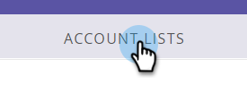

# [!DNL LinkedIn]에서 일치하는 계정 만들기 {#create-an-account-matched-audience-on-linkedin}

[[!DNL LinkedIn] 광고 타깃팅](https://business.linkedin.com/marketing-solutions/ad-targeting/account-targeting)에 대한 TAM 계정 목록에서 계정 일치 대상을 만듭니다. [!DNL LinkedIn]은(는) 목록을 해당 시스템의 계정에 일치시키며, 해당 계정 목록을 기반으로 [!DNL LinkedIn] 대상자를 만들어 [!DNL LinkedIn] 채널에서 활성화할 수 있습니다. 이를 통해 마케터는 데이터베이스 내부 또는 외부의 사용자를 타겟팅할 수 있습니다.

>[!PREREQUISITES]
>
>[일치하는 대상을 LaunchPoint 서비스로 추가 [!DNL LinkedIn] 추가](/help/marketo/product-docs/demand-generation/ad-network-integrations/add-linkedin-matched-audiences-as-a-launchpoint-service.md)

1. TAM에서 **[!UICONTROL Account Lists]** 탭을 클릭합니다.

   

1. 원하는 계정 목록을 선택합니다.

   

1. **[!UICONTROL Account List Actions]** 드롭다운을 클릭하고 **[!UICONTROL Send via AdBridge]**&#x200B;을(를) 선택합니다.

   

1. **[!DNL LinkedIn]**&#x200B;을(를) 선택하고 **[!UICONTROL Next]**&#x200B;을(를) 클릭합니다.

   

1. **[!UICONTROL Audience]** 드롭다운을 클릭합니다. 기존 대상자를 선택하거나 새 대상자를 만들 수 있습니다. 이 예제에서는 새 대상을 만듭니다(기존 대상을 선택한 경우 7단계로 건너뛰기).

   

1. **[!UICONTROL Ad Account]** 드롭다운을 클릭하고 대상 광고 계정을 선택합니다.

   

1. 대상자의 이름을 지정하고 **[!UICONTROL Update]**&#x200B;을(를) 클릭합니다.

   

그게 전부입니다. 계정 목록이 [!DNL LinkedIn]&#x200B;(으)로 푸시되었습니다.

>[!MORELIKETHIS]
>
>[Marketo 목록 또는 스마트 목록을  [!DNL LinkedIn] 대상 세그먼트로 사용](/help/marketo/product-docs/demand-generation/social/social-functions/use-a-marketo-list-or-smart-list-as-a-linkedin-audience-segment.md)
