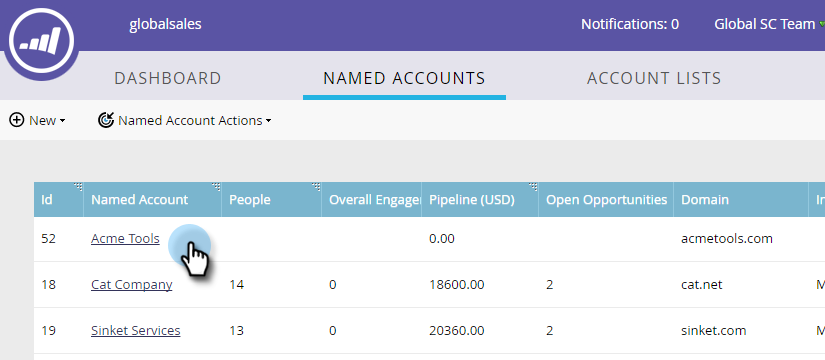

# 계정 목록에 기존 [!UICONTROL Named Account] 추가 {#add-an-existing-named-account-to-an-account-list}

계정 목록에 명명된 계정을 추가하는 것은 간단합니다.

>[!NOTE]
>
>이는 계정 목록에만 적용되며, **아니요**&#x200B;개의 동적 계정 목록입니다.

1. 추가하려는 명명된 계정의 행을 선택합니다.

   

1. **[!UICONTROL Named Account Actions]** 드롭다운을 클릭하고 **[!UICONTROL Add to Account List]**&#x200B;를 선택합니다.

   

1. **[!UICONTROL Account List]** 드롭다운을 클릭하고 원하는 계정 목록을 선택한 다음 **[!UICONTROL Add]**&#x200B;을(를) 클릭합니다.

   

   다 됐습니다!

>[!MORELIKETHIS]
>
>[[!UICONTROL Named Account]](/help/marketo/product-docs/target-account-management/target/named-accounts/create-a-named-account.md) 만들기
