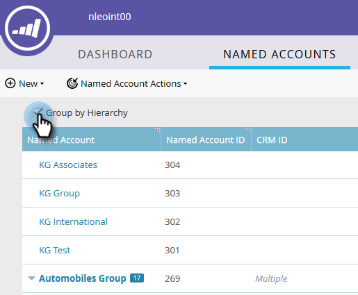
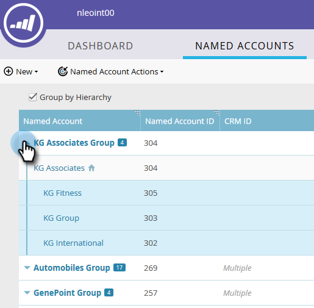

# 계층 만들기 {#create-a-hierarchy}

계층은 CRM에서 생성되어야 합니다. 그러나 CRM이 없는 경우 다음 단계에 따라 수동으로 계층 구조를 만듭니다.

1. [!UICONTROL Named Accounts]에서 **[!UICONTROL Group by Hierarchy]** 확인란을 클릭합니다.

   

   >[!NOTE]
   >
   >CRM이 아닌 계정만 계층 구조를 수동으로 만드는 데 사용할 수 있습니다. CRM 연결 계정은 CRM에서 계층을 만들어야 합니다.

1. ctrl+클릭 (Windows)하거나 Cmd+클릭 (Mac)하여 계층에서 함께 그룹화할 모든 계정을 선택합니다.

   

1. **[!UICONTROL Named Account Actions]** 드롭다운을 클릭하고 **[!UICONTROL Link to Named Account]**&#x200B;를 선택합니다.

   

   >[!NOTE]
   >
   >계정 연결을 해제하려면 위의 단계를 따르되 **[!UICONTROL Unlink From Named Account]**&#x200B;을(를) 선택하십시오.

1. 드롭다운에서 부모 명명된 계정을 선택하고 **[!UICONTROL Link]**&#x200B;을(를) 클릭합니다.

   

1. 이제 명명 계정이 계층의 일부입니다. 왼쪽에 있는 화살표를 클릭하여 모든 하위 계정을 확인합니다.

   
