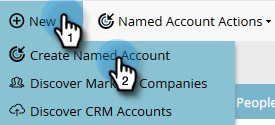

# [!UICONTROL Named Account] 만들기 {#create-a-named-account}

명명된 계정을 수동으로 만들려면 다음 단계를 따르십시오.

1. [!UICONTROL Named Accounts]에서 **[!UICONTROL New]** 드롭다운을 클릭하고 **[!UICONTROL Create Named Account]**&#x200B;을(를) 선택합니다.

   

1. 원하는 필드를 입력하고 **[!UICONTROL Create]**&#x200B;을(를) 클릭합니다.

   

   >[!TIP]
   >
   >명명된 계정을 직접 클릭하여 대시보드를 봅니다.

>[!MORELIKETHIS]
>
>[에 [!UICONTROL Named Account]](/help/marketo/product-docs/target-account-management/target/named-accounts/add-people-to-a-named-account.md)사람 추가
