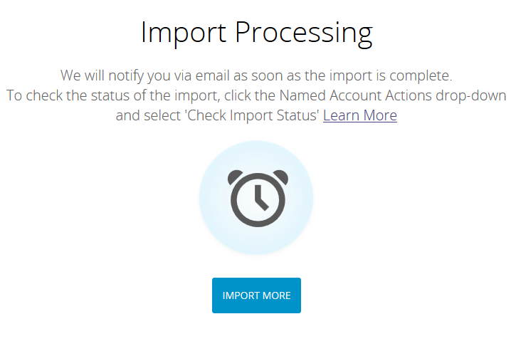

# [!UICONTROL Named Accounts] 가져오기 {#import-named-accounts}

CSV에 잠재적 대상 계정이 이미 가득 찼습니까? TAM으로 바로 가져옵니다!

1. **[!UICONTROL New]** 드롭다운을 클릭하고 **[!UICONTROL Import Named Accounts]**&#x200B;을(를) 선택합니다.

   

1. 새 창이 열립니다. **[!UICONTROL Browse]**&#x200B;을(를) 클릭한 다음 가져올 명명된 계정의 파일을 선택하십시오.

   

   >[!TIP]
   >
   >파일에서 [가능한 많은 정보](/help/marketo/product-docs/target-account-management/target/named-accounts/named-account-overview.md#named-account-attributes)를 제공하세요. 그래픽 정보만 추가할 수 있습니다. Marketo에서 계산하는 것은 없습니다(즉, 파이프라인). CRM 계정을 기반으로 명명된 계정을 만들려면 계정 이름과 CRM의 CRM ID를 CSV 파일로 내보내고, 계정 이름 옵션을 사용하여 가져오기 프로세스 중에 CRM ID를 매핑하면 됩니다. CRM 계정을 명명된 계정에 올바르게 연결하려면 CRM 계정의 정확한 이름을 제공해야 합니다.

1. 계정 이름 또는 도메인 이름, 두 가지 중복 제거 모드 중에서 선택합니다. 이 예제에서는 계정을 선택합니다. **[!UICONTROL Modes]** 드롭다운을 클릭하고 **[!UICONTROL By Account Name]**&#x200B;을(를) 선택합니다.

   

   >[!NOTE]
   >
   >**[!UICONTROL By Domain Name]**&#x200B;을(를) 선택하는 경우 명명된 계정 및 도메인 필드를 모두 포함해야 합니다.

1. 명명된 계정을 추가할 계정 목록을 선택하려면 **[!UICONTROL Account List]** 드롭다운을 클릭하고 선택하십시오.

   

   >[!NOTE]
   >
   >드롭다운 상자에 이름을 입력하기만 하면 새 [!UICONTROL Account List]을(를) 만들 수도 있습니다.

1. 가져오기 알림을 보내려면 **[!UICONTROL Send Alert To]** 드롭다운을 클릭하고 Marketo 사용자를 선택하십시오. 전자 메일 주소를 _수동으로 입력할 수 없습니다_.

   

1. **[!UICONTROL Next]**&#x200B;을(를) 클릭합니다.

   

1. **[!UICONTROL Marketo Field]** 드롭다운을 두 번 클릭하고 적절한 필드를 선택하여 각 필드를 매핑합니다. 완료되면 **[!UICONTROL Next]**&#x200B;을(를) 클릭합니다.

   

   성공!

   

   >[!NOTE]
   >
   >&quot;가져오기 상태 확인&quot;에는 최근 3일의 활동만 표시됩니다.

[!UICONTROL by Account Name]을(를) 중복 제거하는 시나리오:

<table>
 <tbody>
  <tr>
   <td><strong>기존 명명된 계정 이름으로 레코드를 가져오는 중</strong></td>
   <td>
기존 레코드를 업데이트합니다.
</td>
  </tr>
  <tr>
   <td><strong>새 명명된 계정 이름으로 레코드를 가져오는 중</strong></td>
   <td>새 레코드를 만듭니다.</td>
  </tr>
 </tbody>
</table>

[!UICONTROL by Domain Name]을(를) 중복 제거하는 시나리오:

<table>
 <tbody>
  <tr>
   <td><strong>새 계정 이름 및 새 도메인 이름으로 레코드 가져오기</strong></td>
   <td>제공된 정보로 새 명명된 계정을(를) 만듭니다.</td>
  </tr>
  <tr>
   <td><strong>기존 계정 이름 및 기존 도메인 이름으로 레코드 가져오기</strong></td>
   <td>기존 명명된 계정을(를) 업데이트합니다.</td>
  </tr>
   <tr>
   <td><strong>새 계정 이름 및 기존 도메인 이름으로 레코드 가져오기</strong></td>
   <td>도메인 이름과 일치하는 기존 명명된 계정에 새 계정 이름을 추가하고 다른 정보(예: 업종, 주 등)를 업데이트합니다.</td>
  </tr>
  <tr>
   <td><strong>기존 명명된 계정 이름 및 새 도메인 이름으로 레코드를 가져오는 중</strong></td>
   <td>계정 이름과 일치하는 기존 명명된 계정에 새 도메인 이름을 추가하고 다른 정보(예: 업종, 주 등)를 업데이트합니다.</td>
  </tr>
 </tbody>
</table>

>[!NOTE]
>
>Marketo에서 명명된 계정을 추가하면 [!UICONTROL Named Account]의 일부여야 하는 사용자를 식별할 수 있는 규칙을 백그라운드에서 업데이트합니다. 예: &quot;IBM&quot;를 &quot;IBM, USA&quot;로 업데이트하면 두 회사 이름을 가진 사람이 [!UICONTROL Named Account]에 연결됩니다.

Marketo에서 중복으로 표시되는 레코드를 찾으면 첫 번째 레코드만 처리합니다.
