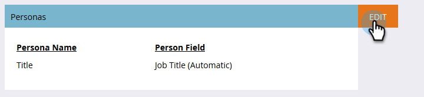

# 페르소나 사용 {#using-personas}

성향 은 ABM 대상자 및 시장을 특정 하위 계층의 대상으로 세분화하는 좋은 방법입니다.

## 사용자 추가 {#add-a-persona}

1. 내 Marketo에서 **[!UICONTROL Admin]**&#x200B;을(를) 클릭합니다.

   

1. 트리에서 **[!UICONTROL Target Account Management]**&#x200B;을(를) 선택합니다.

   

1. **[!UICONTROL Edit]**&#x200B;를 클릭합니다.

   

   >[!NOTE]
   >
   >직함 담당자는 기본적으로 포함됩니다. 수정하거나 삭제할 수 없습니다.

1. 가상 사용자를 추가하려면 **[!UICONTROL +Add]**&#x200B;을(를) 클릭하세요.

   

1. 담당자의 이름을 지정하고 드롭다운에서 해당 필드를 선택합니다. 최대 2개의 가상 사용자를 추가할 수 있습니다. 완료되면 **[!UICONTROL Save]**&#x200B;을(를) 클릭합니다.

   

   >[!NOTE]
   >
   >Marketo 인스턴스에 동기화된 &quot;선택 목록&quot; 유형의 Salesforce 사용자 정의 필드만 담당자를 만들 때 담당자 필드 드롭다운에서 사용할 수 있습니다.

## 성향 보기 {#view-your-personas}

특정 [!UICONTROL Named Account]을(를) 방문하여 가상 사용자를 봅니다.

1. 원하는 [!UICONTROL Named Account]을(를) 선택합니다.

   

1. **[!UICONTROL Personas]** 탭을 클릭합니다.

   

1. 모든 가상 사용자가 나열됩니다. 사람 목록을 보려면 숫자를 클릭하십시오.

   

   >[!NOTE]
   >
   >[!UICONTROL Title Persona]의 X는 와일드카드 문자 역할을 합니다. 예를 들어 &#39;CXO&#39;에는 CEO, CFO 등이 포함됩니다.

## 성향 필터 {#persona-filters}

1. 스마트 목록의 페르소나 필터를 사용하여 특정 사용자 그룹에 마케팅합니다.

