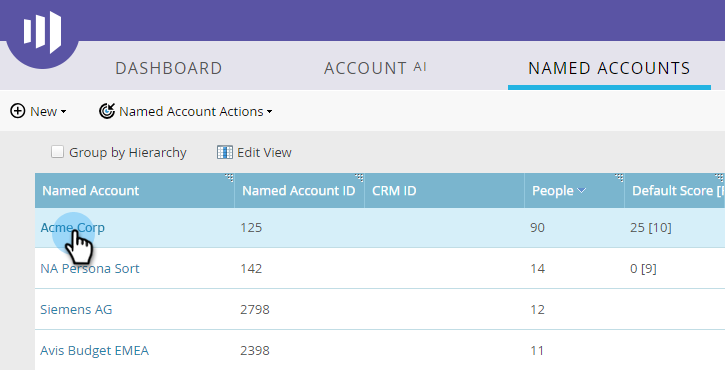

# Personas 사용 {#using-personas}

가상 사용자 는 ABM 대상 및 시장을 특정 사용자 하위 집합으로 분할하는 좋은 방법입니다.

## 모습 추가 {#add-a-persona}

1. 내 Marketo에서 **관리**.

   

1. 트리에서 를 선택합니다 **Target 계정 관리**.

   

1. 클릭 **편집**.

   

   >[!NOTE]
   >
   >기본적으로 작업 제목 모습은 포함됩니다. 수정하거나 삭제할 수 없습니다.

1. 가상 사용자를 추가하려면 **+추가**.

   

1. 사용자에게 이름을 지정하고 드롭다운에서 해당 필드를 선택합니다. 최대 2개의 가상 사용자를 추가할 수 있습니다. 클릭 **저장** 완료 시.

   

   >[!NOTE]
   >
   >Marketo 인스턴스에 동기화된 &quot;picklist&quot; 유형의 Salesforce 사용자 지정 필드만 가상 사용자를 만들 때 성향 필드 드롭다운에서 사용할 수 있습니다.

## 성향 보기 {#view-your-personas}

특정 명명 계정을 방문하여 가상 사용자를 보십시오.

1. 원하는 명명된 계정을 선택합니다.

   

1. 을(를) 클릭합니다. **Personas** 탭.

   

1. 모든 가상 사용자가 나열됩니다. 사람 목록을 보려면 숫자를 클릭합니다.

   

   >[!NOTE]
   >
   >제목 페르소나의 X는 와일드카드 문자로 작동합니다. 예를 들어 &quot;CXO&quot;에는 CEO, CFO 등이 포함됩니다.

## 성향 필터 {#persona-filters}

1. 스마트 목록의 성향 필터를 사용하여 특정 사용자 그룹을 마케팅합니다.

