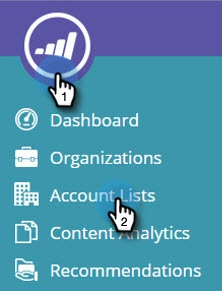
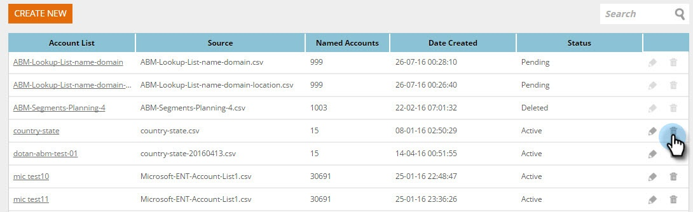

# 새 계정 목록 만들기 {#create-a-new-account-list}

맞춤형 캠페인을 통해 이러한 주요 계정을 대상으로 하는 조직 및 도메인 이름 목록을 만들고 업로드합니다.

>[!NOTE]
>
>이 문서는 이전 웹 ABM 고객에게만 적용됩니다. 2016년 9월 이후에 웹 ABM을 구입한 경우 [이 문서](http://docs.marketo.com/display/DOCS/Account+Lists#AccountLists-CreateaNewAccountList)의 단계를 대신 수행하십시오.

## 새 계정 목록 만들기 {#create-a-new-account-list-1}

1. **계정 목록**&#x200B;으로 이동합니다.

   

1. **새로 만들기**&#x200B;를 선택합니다.

   

1. **찾아보기**&#x200B;를 선택하고 CSV 파일을 업로드합니다(csv 파일이 기준을 충족하는지 확인). **이름** 및 **설명**&#x200B;을 추가합니다. **저장**&#x200B;을 클릭합니다.

   

   >[!NOTE]
   >
   >**CSV 파일의 형식은 무엇입니까?**
   >
   >
   >이름이 지정된 계정 CSV 파일이 다음 요구 사항을 충족하는지 확인합니다.
   >
   >* CSV 형식으로 저장
   >* 10MB를 초과하지 않음
   >* 머리글 열 A가 있는 열은 4개뿐입니다.이름, 열 B:도메인, 열 C:국가, 열 D:미국 주.
   >* 업로드된 파일은 승인 전까지 영업일 기준 최대 2일이 소요될 수 있습니다.
   >* 승인 전자 메일 알림을 받게 되거나 이름 지정된 계정 페이지에서 파일 상태를 확인할 수 있습니다.
   >* 업로드된 모든 목록에 대해 누적된 총 레코드/행 수는 10K로 시작하고 총 100K의 최대 패키지로 시작합니다.

   >[!NOTE]
   >
   >**예**
   >
   >**CSV 파일의 예**
   >
   >* 행 1 열 A 값 = 조직
   >* 행 1 열 B 값 = 도메인
   >* 행 1 열 C 값 = 국가
   >* 행 1 열 D 값 = 미국 주
   >* 열 값 중 하나는 필수입니다. 그러나 조직 및 도메인 이름을 모두 제공하면 계정 목록의 일치 비율이 향상됩니다.
   >* 국가 및 상태는 선택 사항입니다.

      >
      >  
   * 국가 이름의 경우 국가 이름 또는 약어 코드를 사용하십시오. 예. 미국 또는 미국.
   >  * 미국 주에서는 2자 약어 코드(예: CA)를 사용합니다. 미국 주만 인식됩니다.

   >    
   >

## 계정 목록 편집 {#edit-an-account-list}

**계정 목록** 페이지에서 목록에서 **편집 **아이콘을 클릭합니다.

**찾아보기**&#x200B;를 선택하고 새 CSV 파일을 업로드합니다. 이 파일은 원본 파일을 대체합니다. **저장**&#x200B;을 클릭합니다. 업로드된 새 파일은 Marketing Support의 승인을 받을 때까지 보류 중 상태로 유지되며 보류 중인 상태인 경우에는 원래 파일이 활성 상태로 유지됩니다.

CSV 파일이 기존 파일을 대체합니다. 기존 목록은 새 파일 처리가 완료될 때까지 활성 상태로 유지됩니다.

## 지정된 계정 목록 {#delete-a-named-account-list} 삭제

1. **계정 목록 ** 페이지에서 삭제할 목록의 **삭제 ** 아이콘을 클릭합니다.

   

1. 목록을 삭제할지 여부를 확인하는 메시지가 나타납니다. **확인**&#x200B;을 클릭합니다.

   

>[!MORELIKETHIS]
>
>* [계정 목록을 사용하여 세그먼트 만들기](create-a-segment-using-an-account-list.md)
>* [지정된 계정 목록 보기](http://docs.marketo.com/pages/viewpage.action?pageid=4720244)

