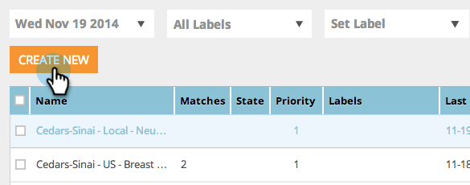

# 계정 목록을 사용하여 세그먼트 만들기 {#create-a-segment-using-an-account-list}

다음은 계정 목록을 사용하여 세그먼트를 만드는 방법입니다.

>[!PREREQUISITES]
>
>[새 계정 목록 만들기](/help/marketo/product-docs/target-account-management/target/account-lists.md)

1. **[!UICONTROL Segments]**(으)로 이동합니다.

   

1. **[!UICONTROL Create New]**&#x200B;를 클릭합니다.

   

1. 세그먼트 이름을 입력합니다. **[!UICONTROL Account Lists]** 섹션에서 **[!UICONTROL Firmographics]**&#x200B;을(를) 끌어서 놓습니다.

   

1. 업로드한 명명 계정 목록에서 계정 목록을 선택합니다. Account List Name 옆의 대괄호 안에 있는 숫자는 API 참조용 목록의 ID입니다.

   

   >[!NOTE]
   >
   >계정 목록은 세분화에 사용할 수 있도록 ABM에서 웹 Personalization으로 동기화됩니다. 드롭다운에서 선택합니다. 동기화는 최대 5분 정도 소요될 수 있습니다. 계정 목록에 명명 계정이 하나 이상 있는 경우에만 동기화됩니다.

1. **[!UICONTROL Save]**&#x200B;을(를) 클릭하거나 **[!UICONTROL Save & Define Campaign]**&#x200B;을(를) 클릭하여 캠페인 페이지로 이동합니다.

   

축하합니다! 이제 계정 목록을 타겟팅하는 세그먼트를 설정했습니다.
