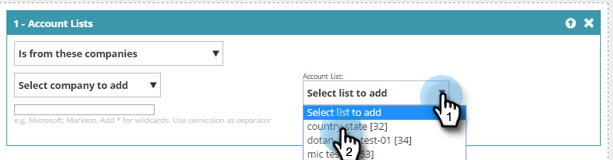

# 계정 목록을 사용하여 세그먼트 만들기 {#create-a-segment-using-an-account-list}

계정 목록을 사용하여 세그먼트를 만드는 방법은 다음과 같습니다.

>[!PREREQUISITES]
>
>[새 계정 목록 만들기](/help/marketo/product-docs/target-account-management/target/account-lists.md)

1. 이동 **세그먼트**.

   

1. 클릭 **새로 만들기**.

   

1. 세그먼트 이름을 입력합니다. 드래그 앤 드롭 **계정 목록** 에서 **Firmographics** 섹션을 참조하십시오.

   

1. 업로드한 명명된 계정 목록에서 계정 목록을 선택합니다. Account List Name 옆에 있는 대괄호로 묶인 숫자는 API 참조를 위한 목록 ID입니다.

   

   >[!NOTE]
   >
   >계정 목록은 세그먼테이션에서 사용할 ABM에서 웹 개인화로 동기화됩니다. 드롭다운에서 선택합니다. 동기화 시간은 최대 5분이 소요될 수 있습니다. 계정 목록에 지정된 계정이 하나 이상 있는 경우에만 동기화됩니다.

1. 클릭 **저장**&#x200B;또는 **캠페인 저장 및 정의** 캠페인 페이지로 이동합니다.

   

축하합니다! 이제 계정 목록을 타겟팅하는 세그먼트를 설정했습니다.
