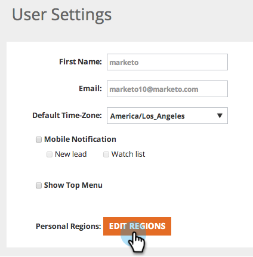

# [!UICONTROL Edit Regions] {#edit-regions}

특정 지역에 대한 데이터만 표시하도록 사용자 지역 설정을 변경하고자 하십니까?

1. **[!UICONTROL User Settings]** 으로 이동합니다.

   

1. **[!UICONTROL Edit Regions]**&#x200B;를 클릭합니다.

   

1. 해당 지역과 관련된 국가 또는 상태를 확인하십시오.

>[!NOTE]
>
>미국을 선택하면 페이지 하단에 선택할 모든 미국 주 옵션이 열립니다.
