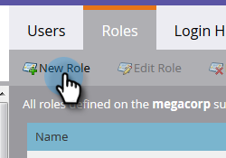

# 로그인 및 사용자 관리 {#login-and-user-management}

## 웹 개인화 사용자 역할 만들기 {#create-a-web-personalization-user-role}

1. 관리 **섹션으로 이동한** 다음 **사용자 및 역할을 클릭합니다**.

   

1. 역할을 **클릭합니다**.

   

   >[!NOTE]
   >
   >WP(웹 개인화) 사용자 역할이 이미 있는 경우 4단계에 표시된 대로 구성되었는지 확인하십시오.

1. 새 **역할을 클릭합니다**.

   

1. 역할 이름을 입력하고 권한을 선택합니다. 만들기를 **클릭합니다** . 이 역할은 모든 작업 영역에 [적용되어야 합니다](http://docs.marketo.com/display/DOCS/Managing+Marketo+Users#ManagingMarketoUsers-CreateUsers).

   

   >[!TIP]
   >
   >사용자에게 타깃팅 및 개인화의 모든 항목에 액세스할 수 있는 권한을 부여하려면 *모든* 확인란을 선택하십시오.

## 웹 개인화 및 예측 컨텐츠 사용자 권한 {#web-personalization-and-predictive-content-user-permissions}

**타깃팅 및 개인화**:이 권한이 선택된 경우에만 사용자에게 보기 권한만 있습니다.

**관리 웹 개인화 + 예측**:사용자는 웹 개인화 및 예측 컨텐츠 앱에 대한 계정 설정 및 컨텐츠 설정에만 액세스할 수 있습니다. 사용자는 앱에서 페이지를 볼 수 있지만 만들기, 편집, 삭제, 실행 권한은 없습니다.

**예측 컨텐츠 편집기**:사용자는 예측 콘텐츠 앱에 대한 편집기에 액세스할 수 있습니다. 이 권한을 통해 콘텐트를 만들고 편집하고 삭제할 수 있습니다. 웹 또는 이메일에서 예측 사용에 대한 컨텐츠를 활성화하도록 허용하지 않습니다.

**예측 컨텐츠 실행**:사용자는 계정 및 컨텐츠 설정을 제외한 모든 예측 컨텐츠 기능에 액세스할 수 있습니다. 이 권한을 통해 콘텐츠 조각을 만들고, 편집하고, 삭제하고, 활성화할 수 있습니다.

**웹 캠페인 편집기**:사용자는 모든 웹 개인화 기능에 대한 편집기에 액세스하여 웹 캠페인을 만들고, 편집하고, 삭제할 수 있지만, 웹 캠페인을 시작할 수는 없습니다.

**웹 캠페인 시작 관리자**:사용자는 계정 및 콘텐츠 설정을 제외한 모든 웹 개인화 앱 기능에 액세스할 수 있습니다. 이 권한을 통해 웹 캠페인을 만들고, 편집하고, 삭제하고, 실행할 수 있습니다.

## 사용자에게 WP 역할 할당 {#assign-wp-role-to-user}

1. 사용자로 **이동합니다**.

   

1. WP 액세스 권한을 부여할 사용자를 선택하고 사용자 **편집을 클릭합니다**.

   

1. 모든 작업 영역에 대한 WP 사용자 역할을 선택합니다.

   

1. 새로 활성화된 사용자는 다음에 로그인할 때 **웹 개인화** 타일이 내 마켓에서 표시됩니다.

   
