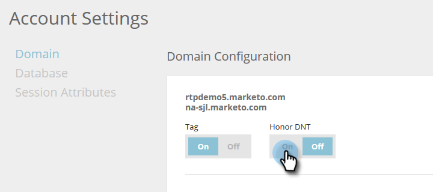

# 웹 개인화를 {#setting-web-personalization-to-do-not-track}을(를) 추적하지 않도록 설정

웹 방문자는 &quot;DNT(Do Not Track)&quot;를 선택하여 모든 웹 사이트의 추적을 방지하도록 브라우저를 설정할 수 있습니다. 이렇게 하면 특정 브라우저 및 장치에 대한 추적을 방지할 수 있습니다.

웹 개인화 및 예측 컨텐트에서 마케터는 브라우저의 DNT(Do Not Track) 설정을 지원할지 또는 무시할지를 나타내는 전환을 설정할 수 있습니다. 계정 토글이 기본값으로 설정되어 있지 않으므로, 이는 애플리케이션에서 DNT를 적용하지 않음을 의미합니다.

## {#enable-or-disable-the-toggle} 전환 활성화 또는 비활성화

1. **계정 설정**&#x200B;으로 이동합니다.

   

1. 도메인 및 도메인 구성에서 **On**&#x200B;을 선택하여 DNT 전환 적용을 활성화합니다.

   

   토글이 켜짐으로 설정되어 있으면, 웹 개인화는 브라우저의 DNT(Do Not Track) 설정을 존중하고 지원하며, 웹 활동을 추적하거나 웹 사이트에서 캠페인 또는 컨텐츠 추천을 실행하지 않습니다.

   >[!NOTE]
   >
   >켜기로 전환을 설정하면 특정 영역의 Marketing To 값 및 기능에 영향을 줄 수 있습니다.

1. DNT 전환 적용을 비활성화하고 브라우저의 DNT(Do No Track) 설정을 무시하려면 DNT 적용 아래에서 **Off**&#x200B;을 선택합니다.

