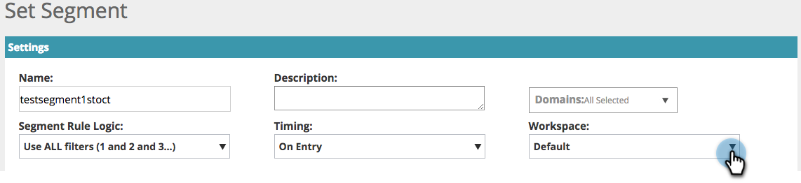

# 웹 Personalization의 작업 공간 {#workspaces-in-web-personalization}

웹 Personalization은 웹 캠페인 및 웹 세그먼트에 대한 여러 작업 공간을 지원합니다.

## 작업 영역 전환 {#switch-workspaces}

웹 개인화의 작업 공간 간을 전환하려면 왼쪽 상단의 지구본 아이콘을 클릭하고 드롭다운에서 다른 작업 공간을 선택합니다.

## 세그먼트의 Workspace 변경 {#change-a-segments-workspace}

1. **세그먼트** 페이지로 이동하여 세그먼트를 선택하고 편집 아이콘을 클릭합니다.

   

1. **Workspace** 드롭다운에서 다른 작업 영역을 선택하십시오.

   

   

>[!NOTE]
>
>사용자는 액세스 권한이 있는 작업 영역과 관련된 웹 캠페인 및 세그먼트만 볼 수 있습니다. [사용자에게 하나 이상의 작업 영역에 대한 액세스 권한을 부여하는 방법](/help/marketo/product-docs/administration/workspaces-and-person-partitions/allow-user-access-to-a-workspace.md)은 다음과 같습니다.
