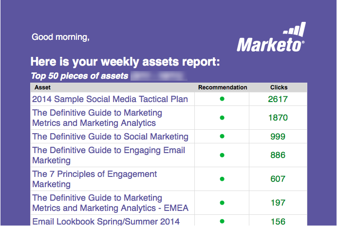

# 이메일 보고서 {#email-reports}

사용자가 받는 자동 이메일 보고서를 사용자 지정하려면  [사용자 설정 섹션](/help/marketo/product-docs/web-personalization/getting-started/user-settings.md).

## 웹 개인화 이메일 보고서 {#web-personalization-email-reports}

일별 또는 주별 이메일 보고서는 최신 조직, 개인, 캠페인 및 자산 성능 데이터를 제공하는 사용자의 이메일 주소로 전송됩니다.

다음 보고서를 사용할 수 있습니다.

## 일별/주별 조직 보고서 {#daily-weekly-organizations-report}

일별/주별 보고서는 사용되는 조직 이름, 위치, 방문 횟수, 페이지 보기 수 및 참조 사이트 또는 검색어를 포함하여 상위 50개 방문 조직의 이메일을 사용자에게 보냅니다.

## 일별/주별 사람 보고서 {#daily-weekly-people-report}

일별/주별 사용자 보고서는 다음과 같이 웹 사이트에서 최근 100명의 사용자를 이메일로 보냅니다. 개인의 이메일 주소, 조직 이름, 위치, 상태, 개인 캡처 날짜 및 개인이 속한 세그먼트가 있습니다.

## 성과가 좋은 실시간 캠페인 {#top-performing-real-time-campaigns}

최고 성과 실시간 캠페인 보고서는 사용자에게 가장 성과가 좋은 실시간 캠페인의 이메일을 전송하여 캠페인 이름, 노출 수, 클릭 수, 캠페인이 반응한 세그먼트 및 캠페인의 전환율을 보여줍니다.

## 성과가 가장 높은 자산 보고서 {#top-performing-assets-report}

최상위 성과 자산 보고서 는 다른 자산과 비교하여 자산 이름 및 일치율의 비율을 표시하여 사용자에게 상위 성과 컨텐츠 자산의 이메일을 보냅니다.

## 권장 자산 보고서 {#recommended-assets-report}

권장 자산 보고서 는 사용자에게 컨텐츠 권장 사항 엔진에 표시되는 컨텐츠에서 발생한 모든 컨텐츠 및 클릭 수의 이메일을 전송합니다.

## 요약 보고서 {#summary-report}

요약 보고서는 사용자에게 개인화된 캠페인 또는 권장 컨텐츠에 참여하는 사용자(직접 또는 지원)와 클릭 수 및 수에 따라 모든 캠페인과 권장 컨텐츠 성능의 이메일(월별 또는 분기별)을 전송하여 알려진 사람이 되었습니다. 보고서는 결과를 이전 월 또는 분기와 비교합니다.

>[!NOTE]
>
>**정의**
>
>**직접 전환**: 개인화된 캠페인 또는 권장 컨텐츠 자산과 동일한 방문 세션에서 클릭하는 웹 방문자가 계속 진행하여 웹 사이트의 모든 양식을 이메일 주소로 채웁니다.
>
>**지원 전환**: 이전 방문(지난 6개월 이내)에서 개인화된 캠페인 또는 권장 컨텐츠 자산을 클릭한 동안 웹 사이트에서 양식을 작성하고 이메일 주소를 나가는 웹 방문자입니다.

>[!NOTE]
>
>Marketo 웹 개인화는 웹 사이트에서 완료된 양식에 대해 웹 방문자의 이메일 주소를 캡처합니다. 이 이름은 웹 개인화 사용자 페이지에서 볼 수 있으며 요약 보고서에서 사용되는 사용자입니다.

사용자가 받는 자동 이메일 보고서를 사용자 지정하려면 [사용자 설정 섹션](/help/marketo/product-docs/web-personalization/getting-started/user-settings.md).
