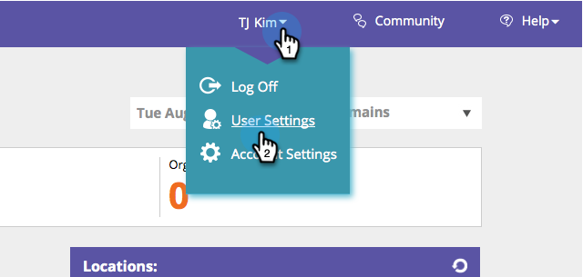

# 보고서 구독 활성화/비활성화 {#enable-disable-report-subscriptions}

[!UICONTROL Web Personalization]에 전자 메일을 통해 전송되는 유용한 보고서가 몇 가지 있습니다. 구독하는 방법은 다음과 같습니다.

1. [!UICONTROL Web Personalization]에 로그인합니다. 로그인 이름 아래에서 **[!UICONTROL User Settings]**&#x200B;을(를) 클릭합니다.

   

1. 구독할 보고서를 선택합니다. 이 보고서의 빈도입니다. **[!UICONTROL Save]**&#x200B;를 클릭합니다.

   

   보고서에서 구독을 취소하려면 선택을 취소하고 **[!UICONTROL Save]**&#x200B;을(를) 클릭합니다.
