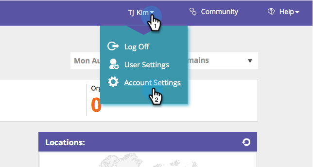

# 특정 IPS를 추적에서 제외 {#exclude-specific-ips-from-being-tracked}

[!UICONTROL Web Personalization]의 추적 및 보고에서 자신의 직원 및 조직 이름을 제외하시겠습니까?

개별 IP와 IP 범위의 전부 또는 일부를 제외할 수 있습니다.

>[!NOTE]
>
>이 프로세스는 완료하는 데 최대 5분 정도 걸릴 수 있습니다.

1. [!UICONTROL Web Personalization]에 로그인하고 로그인 아래의 **[!UICONTROL Account Settings]**&#x200B;을(를) 클릭합니다.

   

1. **[!UICONTROL IP Exclude]** 영역까지 아래로 스크롤합니다. IP 주소를 처음으로 제외하는 경우 빈 **[!UICONTROL Exclude IP Addresses]** 필드를 클릭합니다.

   

1. 추적 및 보고에서 제외할 개별 IP 또는 IP 범위를 입력하고 **[!UICONTROL Save]**&#x200B;을(를) 클릭합니다.

   

   >[!NOTE]
   >
   >단일 IPv4 또는 IPv6 주소나 전체 범위, 세미 범위 또는 서브넷 마스크별로 제외할 수 있습니다. 위의 예의 항목은 Marketo 양식 자체에 제공된 예제를 기반으로 각 항목 중 하나를 보여 줍니다.

1. 이제 [!UICONTROL Exclude IP Addresses] 필드에 입력한 IP 주소가 나열됩니다. IP 제외를 편집하려면 녹색 더하기 기호를 클릭하여 양식을 다시 엽니다.

   

   그게 얼마나 쉬운지 봤어? 이제 개별적으로 또는 범위별로 추가된 IP에서 모든 데이터를 제외할 수 있습니다.
